# Small Office LAN Network Simulation with Active Directory (Part 1: Splunk Server)

## Introduction

In this project, I have constructed a mini Office LAN network using VMWare virtual machines, including:

- Active Directory Domain Controller
- Splunk Server
- Kali Linux

Below is a diagram of our network topology.  


The main steps used for this project are:

1.  Set up the virtual machines; Splunk Server on Ubuntu, Kali Linux, Window 10 hosts and Windows 2022 server.
2.  Install Splunk Universal Forwarder on the host machines and on the Windows 2022 server.
3.  Install Active Directory on Windows 2022 Server, create a domain, then and allow host to join the domain.
4.  Simulate brute-force attacks from Kali Linux machine to hosts, and check whether Splunk Server has detected the attack.
5.  Simulate different attacks in the hosts using the Atomic Red Team tool, then check whether Splunk Server has recorded them.

---

## Step 1 - Setting up the Virtual Machines

The below table shows our setup for each virtual machine.

| Device          | IP Address        | Operating System (iso) | Storage | Memory |
| --------------- | ----------------- | ---------------------- | ------- | ------ |
| `Splunk_Server` | `192.168.174.10`  | Linux Debian           | 30 GB   | 4 GB   |
| `ADDC_Server`   | `192.168.174.7`   | Microsoft Server 2022  | 60 GB   | 2 GB   |
| `Mgmt-PC`       | `192.168.174.129` | Windows 10             | 60 GB   | 4 GB   |
| `IT-PC`         | `192.168.174.161` | Windows 10             | 60 GB   | 4 GB   |
| `Kali Linux`    | `192.168.174.250` | Linux Debian           | 80 GB   | 4 GB   |

The virtual machines are run through VMWare Workstation. Our virtual network, `SO-LAN`, has the address `192.168.174.0/24`, and all the machines are placed into the same virtual network as the VMWare NAT adapter (with address `192.168.174.2`). This acts as our default gateway to the Internet.

`Mgmt-PC` and `IT-PC` are our host machines, used by the Management Department and IT Department of a Small Office company respectively.

`Splunk_Server`, as its name suggests, is a server that hosts Splunk - a Security Information and Event Management (SIEM) platform that organises and analyses data generated by our hosts. It is especially useful in detecting attacks on the host machines, which will be demonstrated later in this project.

`ADDC_Server` is the Domain Controller of our domain i.e. it acts as the central management device for the Active Directory services of our domain. In this project, we will perform authorization by restricting login access on the host computers.

`Kali Linux` is an open-source Linux distribution designed for penetration testing and digital forensics. It will be used to conduct attacks on the host machines using Atomic Red Team.

### Splunk_Server

After installation, we first want to configure a static IP for the splunk server. We achieved this by using `sudo netplan apply` on a manual configuration.

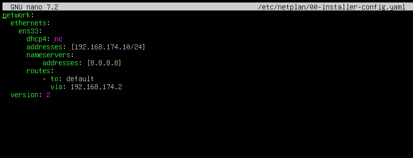

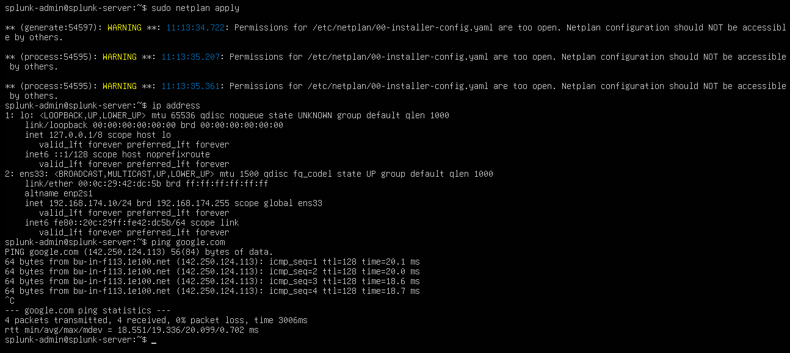

We set our network configuration to have the static IP of 192.168.174.10, default gateway of `192.168.174.2` (NAT adapter) and DNS nameservers to Google `8.8.8.8`.

After successful pinging for connectivity, we can now install Splunk. We first installed Splunk Enterprise Debian version onto our local device, then create a shared folder in which we mount onto the `Splunk_Server` VM. The command to mount a shared folder in VMWare is `sudo vmhgfs-fuse`.


We can then see that Splunk has been successfully mounted onto the VM storage. We can find our Splunk folder through `cd ./opt/splunk`.


Once the Splunk file has been successfully mounted, we can now try to activate Splunk. Since from the output of `ls -al` we see that the owner of the folder is `splunk`, we first must become the user `splunk`. This is achieved by the command `sudo -u splunk bash`.


Finally, we will redirect to the `bin` directory of splunk and start Splunk.

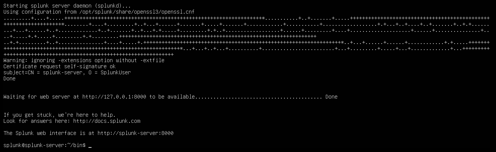

The Splunk Server is now activated on the network; any device on the network can now connect to Splunk through the address `192.168.174.10:8000`.

## Step 2 - Installing Splunk Universal Forwarder

We now need to install Splunk Universal Forwarder and Sysmon in both `ADDC_Server` and the host machines. Sysmon is a Windows SysInternals tool that provides detailed logging of system activities; Splunk Universal Forwarder is responsible for delivering them to the Splunk server.

We first configure `ADDC_Server`, `Mgmt-PC` and `IT-PC` with their corresponding IPv4 addresses.


_Configure IPv4 address on ADDC_Server_

We can then verify the IP configuration through the command `ipconfig all` on Command Prompt. Next, we will change the PC name on each device.

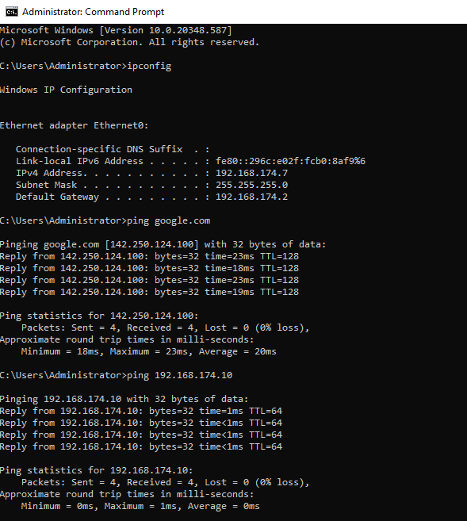

After configuration, the device would be able to connect to the Splunk instance, as it is now a host inside our virtual network.

Moreover, we install the Splunk Universal Forwarder from the Splunk website on each VM.

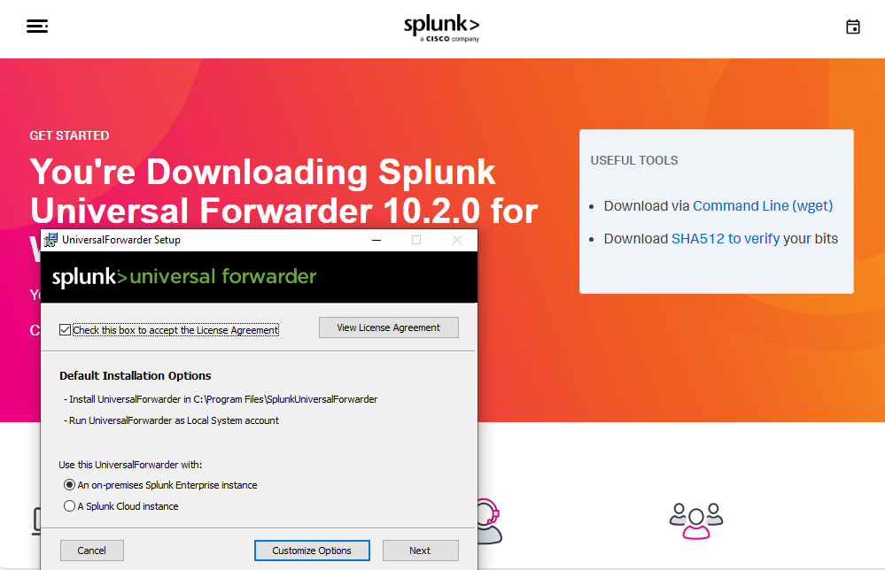

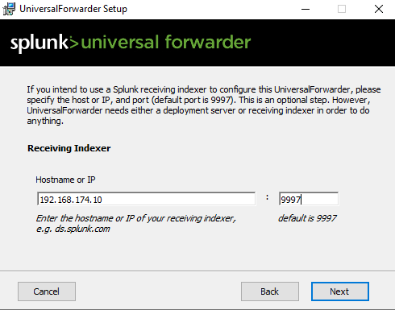

Also, we install Sysmon from [Microsoft Learn](https://learn.microsoft.com/en-us/sysinternals/downloads/sysmon). In addition, the installation will be carried out according to the config file `sysmonconfig.xml`, which specifies what events to log or ignore. This configuration file is provided in the courtesy of `olafhartong` on [GitHub](https://github.com/olafhartong/sysmon-modular).


We then control what Splunk Forwarder sends to its server by customizing `inputs.conf` in the folder `C:\Program Files\SplunkUniversal Forwarder`. Below is the configuration for `inputs.conf`, which declares what Windows Event Logs to collect and forward to Splunk Server.

```
[WinEventLog://Application]
index = endpoint
disabled = false

[WinEventLog://Security]
index = endpoint
disabled = false

[WinEventLog://System]
index = endpoint
disabled = false

[WinEventLog://Microsoft-Windows-Sysmon/Operational]
index = endpoint
disabled = false
renderXml = true
source = XmlWinEventLog:Microsoft-Windows-Sysmon/Operational
```

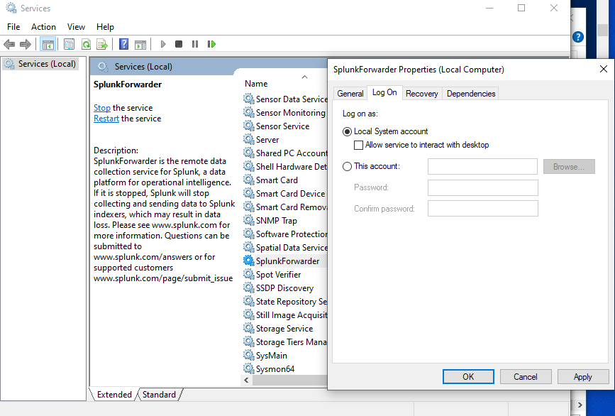

However, this configuration would not be applied until we restart the Splunk Forwarder on `services.msc` through running as administrator. I also changed the "Log On" permissions to local to allow for authorised log collection.

Finally, we can open Splunk on our browser and log in; we then create an index named "endpoint", which corresponds to the index name in the above `inputs.conf` file. We then configure port 9997 as the receiving port.

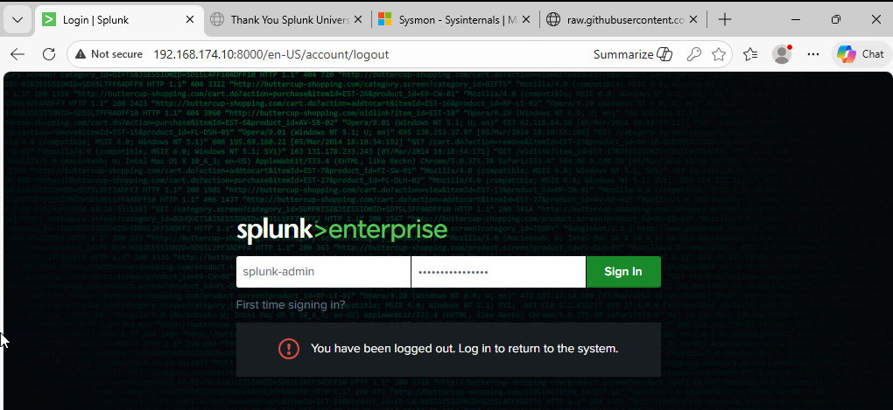

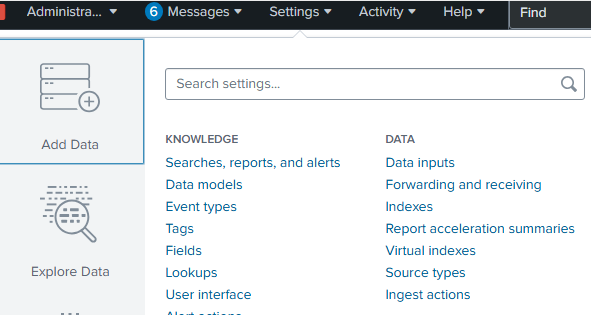


Finally, when we filter for `index="endpoint"` in our search, we will find a long list of logs generated from our hosts and Active Directory server.


---

## Step 3 - Install Active Directory on Windows 2022 Server and create a domain

On `ADDC_Server`, we open the Server Manager, then click on Manage > Next > Role-based > Add Active Directory Domain services. This will create our domain.


We then name our domain `SO-LAN`, and promote `ADDC_Server` as the Domain Controller. We then add the domain to a new forest with the root domain name of `SO-LAN.local`.

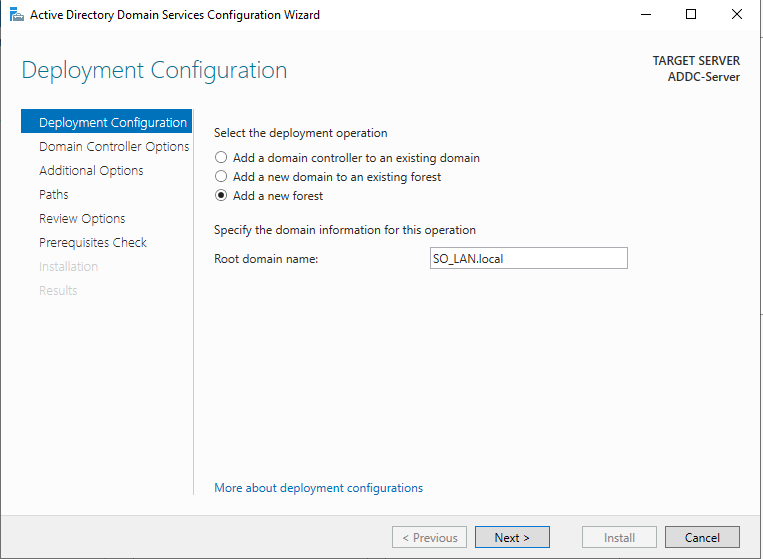

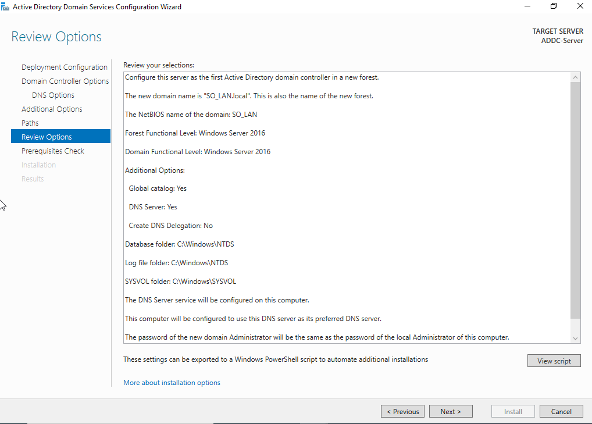

After configuring the password, leave everything as it is, then click Install. The computer will be restarted. The login screen shows `SO-LAN\Administrator`, which means `ADDC-Server` has been succesfully registered into the domain!


Let's log back into the Server Manager console, and create our users for the host machines `Mgmt-PC` and `IT-PC`. We would like to do this because we can configure access control by preventing cross-department access. (e.g. an user from IT cannot log in to Management PCs).

Here is a table of the users of this network. (The names in the below table are fictional and do not reflect real persons' or organisations' names).

| Name       | Username | Department | PC Access |
| ---------- | -------- | ---------- | --------- |
| Eva Woods  | `ewoods` | Management | `Mgmt-PC` |
| John Smith | `jsmith` | IT         | `IT-PC`   |

We first create an Organizational Unit (OU) for each department.

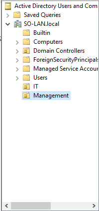

Then create users in each department's OU.

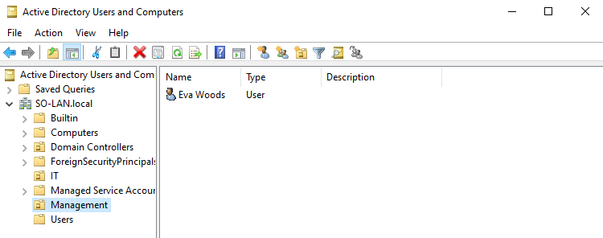
_List of users in Management Department_


_List of users in Management Department_

P.S. we should check the password requirements when creating our passwords. This can be found on `rsop.msc` > Computer Configuration > Policies > Windows Settings > Security Settings > Password Policy


After configuring passwords for each user, we then restrict each user to only access PCs of their respective departments.


Finally, we make each host machine join the newly created `SO-LAN` domain. In particular, we need to change the preferred DNS server to the Domain Controller `192.168.174.7`, as this will allow the host machines to contact the Domain Controller.

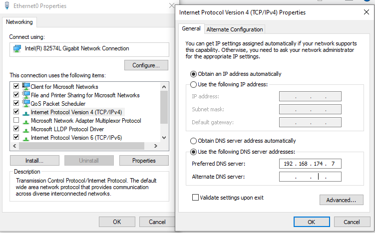

Search PC > Properties > Advanced System Settings > Computer Name > "To rename this computer or change it domain or workgroup..."

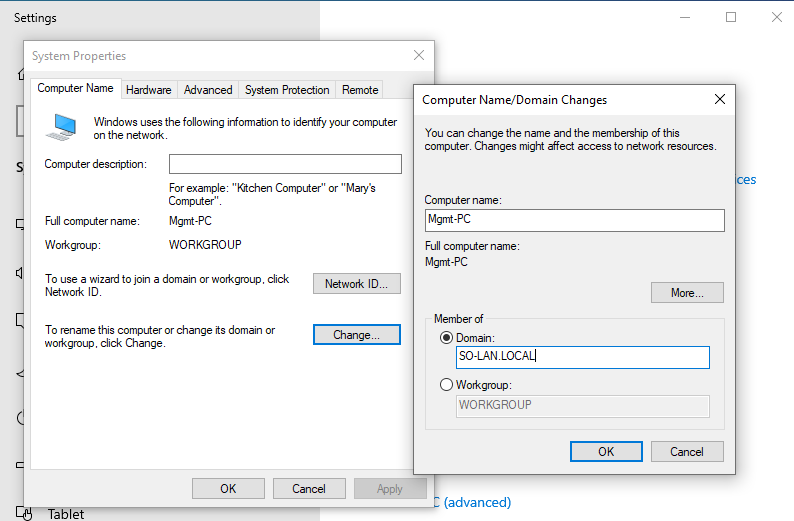

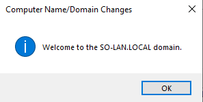

After restarting the computer, we see that we can only login through a user.

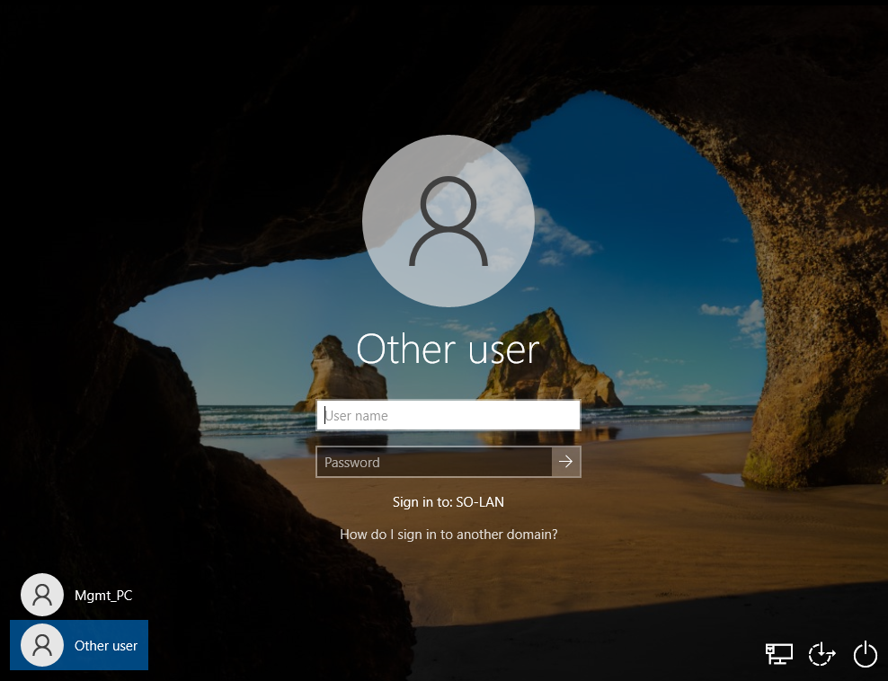

We can try to log in with user credentials of the wrong department; the login is unsuccessful. In fact, one can only login by typing the credentials of a user in the matching department.


Only when we type the correct credentials, we can log back in.


---

## Step 4 - Simulating brute-force attacks

We can now finally simulate an adversarial attack using Kali Linux. In this part, we will simluate brute-force attacks using Hydra, a penetration testing tool to test password security. Specfically, we are conducting dictionary attacks on RDP and SMB.

But before all this, we need to first make Kali Linux join the network.

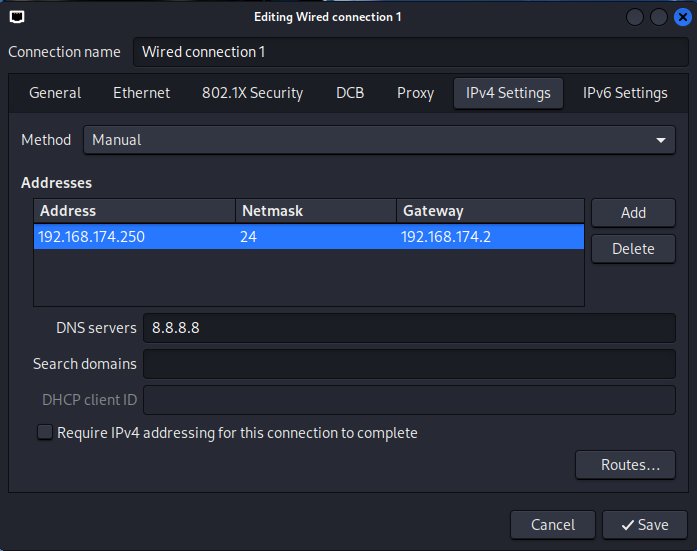

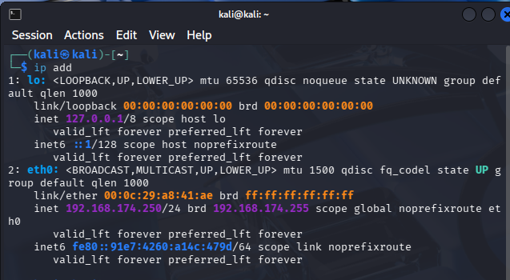

After that, we need to retrieve a password list file. This is readily available in Kali Linux - `rockyou.txt.gz` in the folder `/usr/share/wordlists`.
We have unzipped `rockyou.txt.gz` and store the first few passwords into a new file called `passwords.txt`.

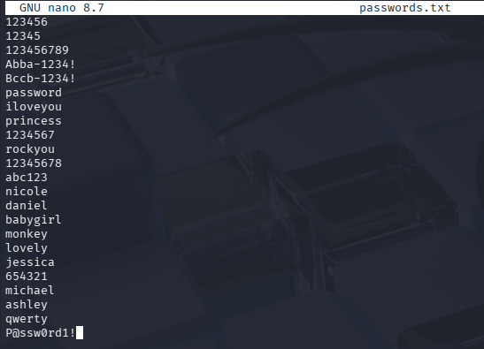

To simulate our attack, we need to enable Remote Desktop Protocol (RDP) in our host machines. This is achieved by This PC > Properties > Related Systems > Advanced System Settings > Remote Tab > Allow Remote Conncetions this computer. We need to allow connections from our office users.

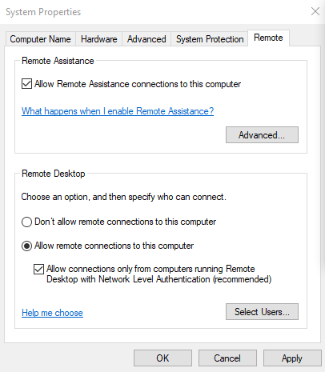

Once RDP is activated, we can now launch a dictionary attack from Kali Linux using Hydra:

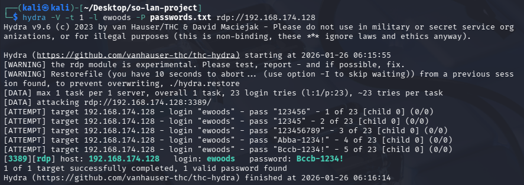

The attack is successful. Now if we go back to Splunk, we can see there is a successfull log-on attempt by Kali Linux.

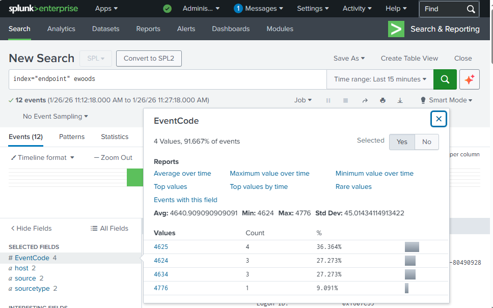

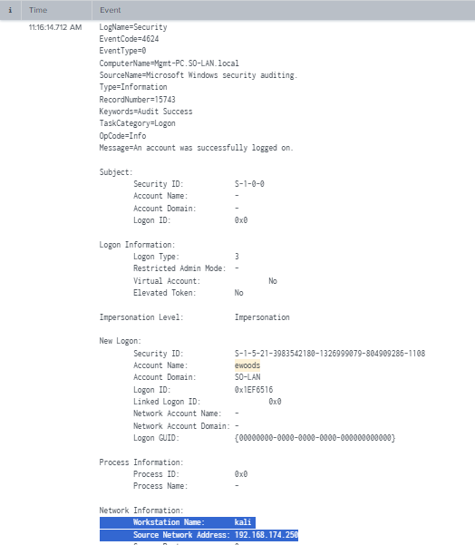

---

## Step 5 - Simulate different attacks through Atomic RedTeam

Atomic Red Team is an open-source tool which is heavily utilised for security testing and simulating adverary tactics in accordance to the MITRE ATT&CK framework. It contains a library of small focused tests (known as "atomic tests") that mimic real-work attack techniques, allowing security teams to quickly evaluate their defense systems.

Firstly, we type the command `Set-ExecutionPolicy Bypass CurrentUser` to allow unrestricted execution of PowerShell scripts for the current user.

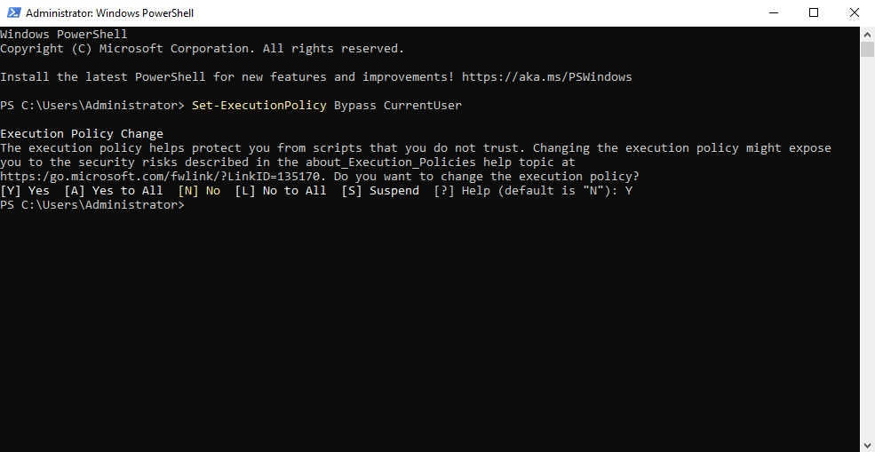

We then implement an exclusion for the C:\ Drive, so that Windows Defender won't automatically remove files from Atomic Red Team as it may be detected as a source of threat.


We now can install Atomic Red Team.

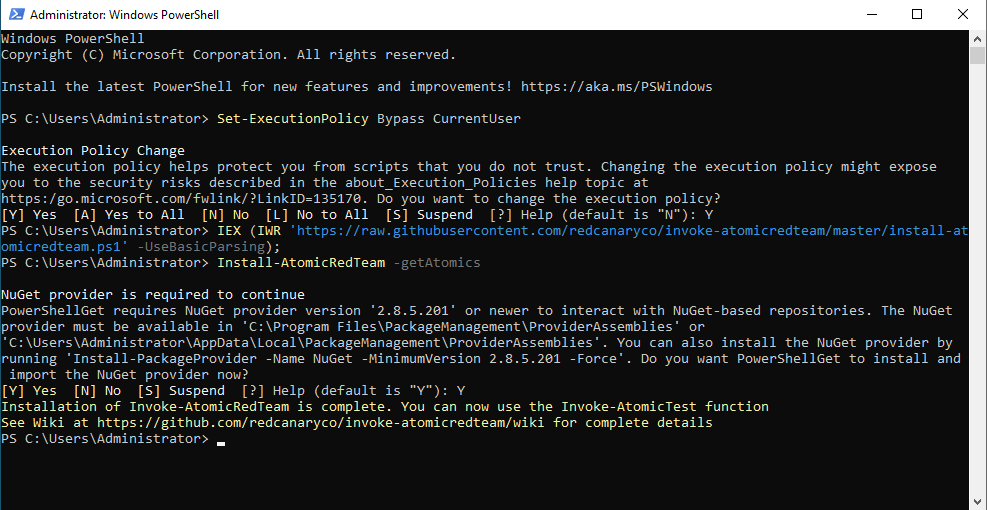

There is a large range of MITRE ATT&CK techniques available for testing in Atomic Red Team. In this part, we have chosen T1136.001, which is Account Creation (Local Account). This script creates a new user named `NewLocalUser` and deletes it immediately afterwards.

Let's see if Splunk can detect this attack. Here, we search for `index="endpoint" NewLocalUser`.

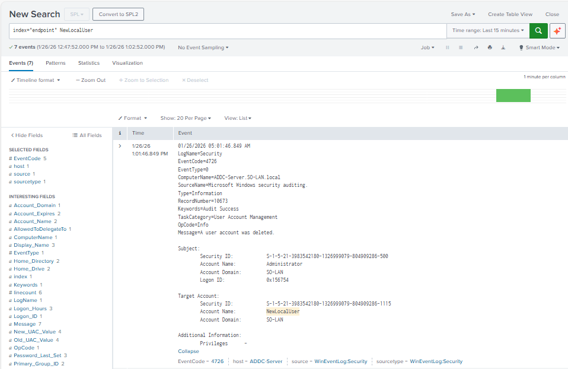

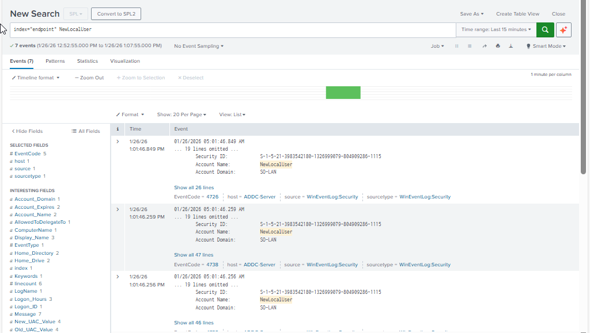

Nice. Now we can try T1059, Command and Scripting Interpreter for Powershell.

On Splunk, if we serach `powershell bypass`, we can find the corresponding event after executing the command.

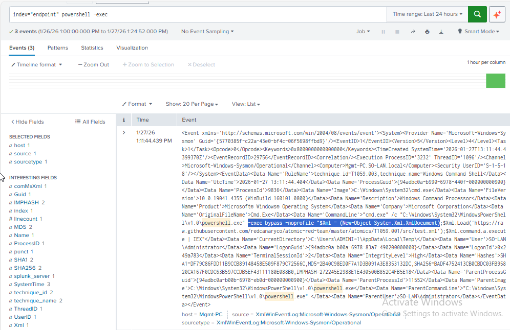

---

## Conclusion

In this project, we successfully built a small office LAN environment that demonstrates fundamental enterprise security monitoring concepts. By integrating Splunk with Active Directory, we created a realistic network where it contains the following security features:

- **Centralised Logging** was achieved through Splunk Universal Forwarder and Sysmon, enabling visibility into Windows Event Logs across all domain-joined machines.
- **Access Control** was enforced via Active Directory, restricting users to their department-specific workstations.
- **Attack Detection** was validated by simulating brute-force attacks with Hydra and adversary techniques with Atomic Red Team, both of which were captured and visible in Splunk.

This setup also emphasises the importance of SIEM platforms in detecting malicious activity. The logon attempts from the Hydra attack and the suspicious account creation from Atomic Red Team were all recorded, demonstrating how security teams can use such logs to identify and respond to threats.

In Part 2, we will expand on this foundation by exploring security features available on Active Directory, and how to enhance scalability using Group Policies and Shared Resources.

---
