## Introduction

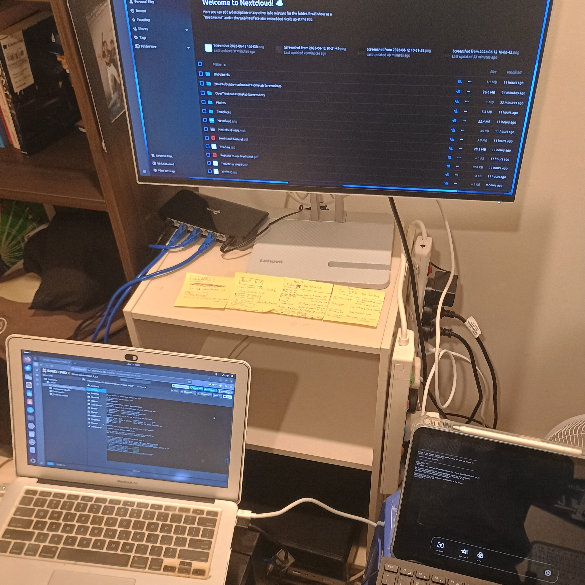

Hello everyone! This is Part 2 of a series of articles documenting my Private Cloud home lab, which will be divied into different parts.

1. Hardware Equipment Setup; Proxmox Server Installation
2. _YOU ARE HERE!_ Creating NextcloudPi LXC Container
3. Setting up Docker hosting Nextcloud
4. Access Control using Tailscale VPN
5. On-Premise and AWS Storage Backup

In this home lab project, I have built a private cloud hosted on a Docker LXC Container in Proxmox OS. This private cloud can only connected using a VPN, with additional access controls so that only my personal devices have access. The storage in the private cloud has multiple backups, one on a SSD flash drive mounted on a Proxmox Server, and another on the public cloud (AWS S3).

## Continuing from last part...

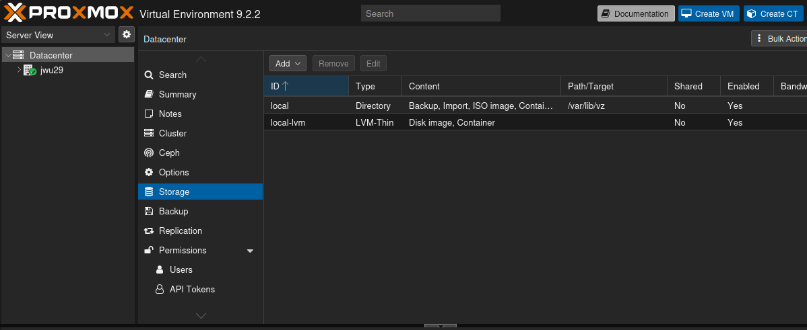

Picking up from Part 1, the Proxmox VE 9.2.2 interface is now accessible. The **Storage** section under the Datacenter view shows two storage pools configured on the `jwu29` node: a `local` directory store at `/var/lib/vz` (used for backups, ISO images, and container templates) and a `local-lvm` LVM-Thin volume (used for disk images and containers). Both are enabled and ready for use. This is the foundation we will build upon to provision our LXC container.

## Create LXC Container with Ubuntu Server OS

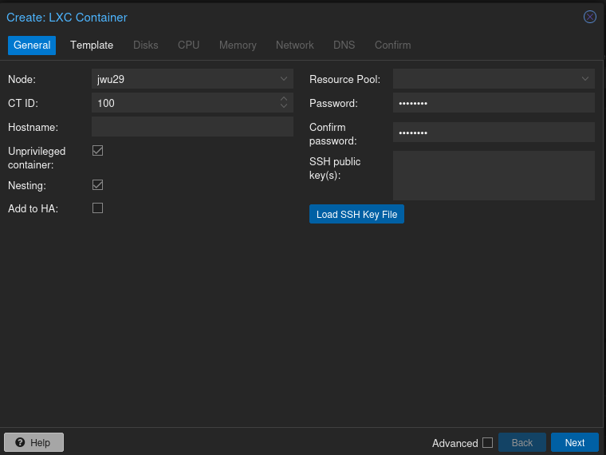

Clicking `Create CT` in the top-right corner opens the `Create: LXC Container` wizard. In the `General` tab, the container is assigned CT ID `100` on node `jwu29`. The `Unprivileged container` and `Nesting` options are both ticked — unprivileged mode runs the container with a remapped user namespace for improved security, and nesting is required so that Docker can run inside the container later in the series.

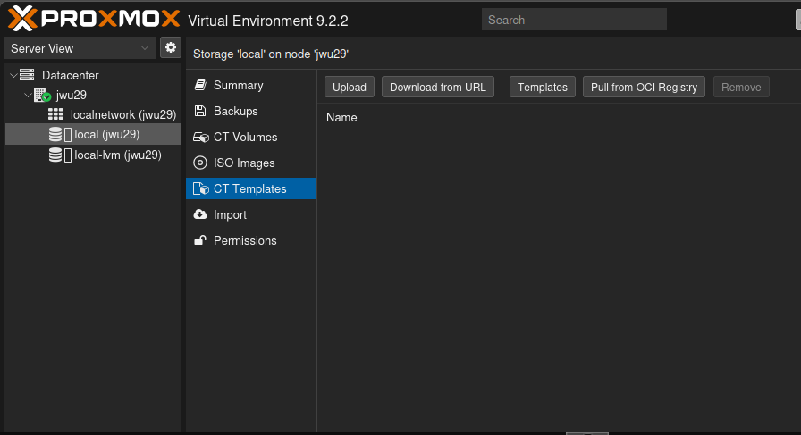

Before the container can be created, an OS template is needed. Navigating to `local (jwu29)` -> `CT Templates` in the left-hand sidebar reveals an empty template library. The `Download from URL` and `Templates` buttons at the top allow us to fetch an official template directly from Proxmox's mirror.

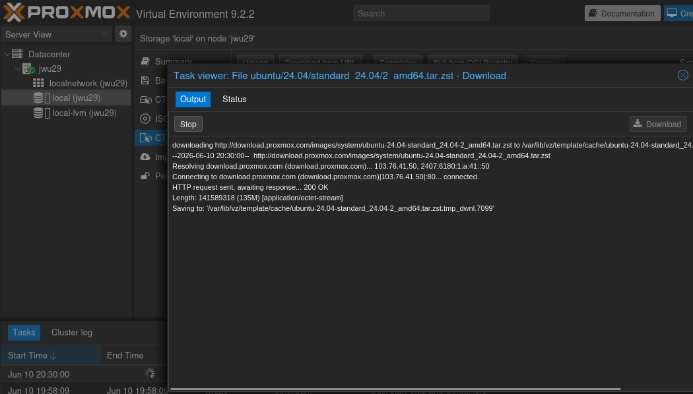

Selecting the **Templates** option triggers a download of the `ubuntu/24.04/standard 24.04-2 amd64.tar.zst` image (135 MB) directly from Proxmox's image server. The Task Viewer confirms a successful HTTP 200 response and shows the file being saved to `/var/lib/vz/template/cache/`. Once complete, this template will be available to use when creating the LXC container.

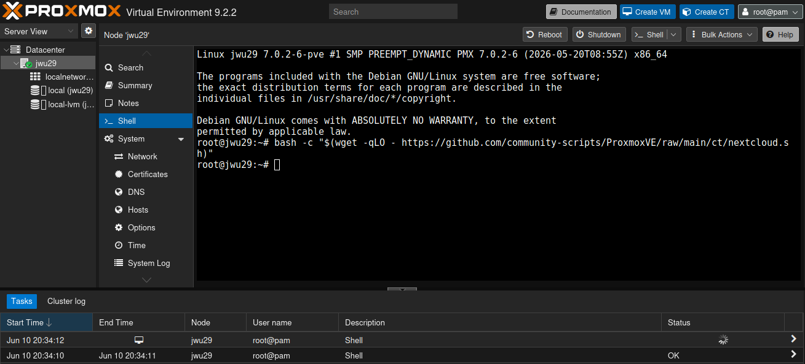

With the template downloaded, we open the Proxmox **Node Shell** (`jwu29`) to begin provisioning NextcloudPi. The node is running the Proxmox VE kernel on a Debian GNU/Linux base. An initial attempt is made using a `wget`-based community script targeting the generic Nextcloud script — however, as revealed in the task log of the next step, this session will error out, prompting us to use the correct NextcloudPi-specific script instead.

## Installing NextcloudPi

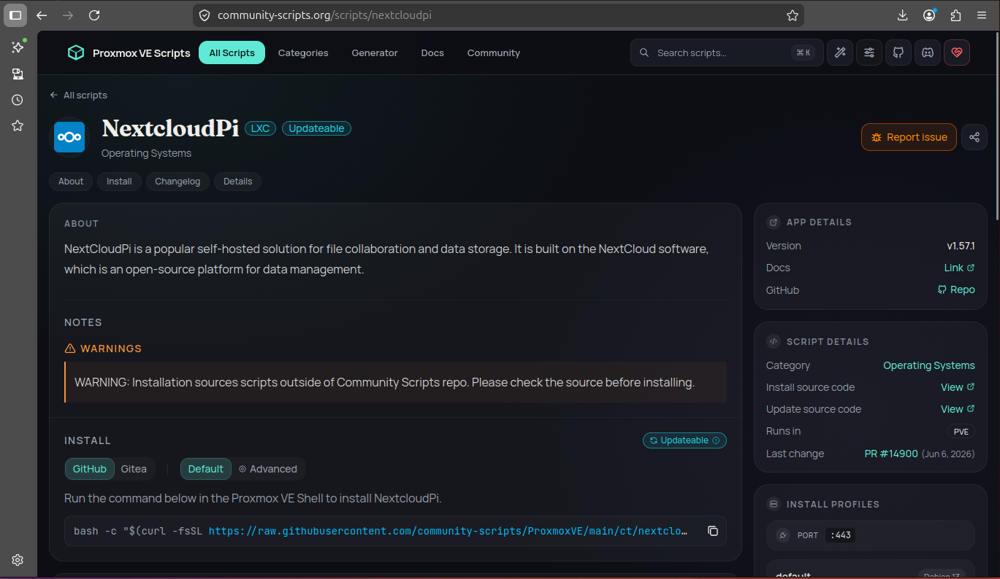

Rather than manually installing NextcloudPi from scratch, we use the **Proxmox VE Helper Scripts** community project (community-scripts.github.io). The NextcloudPi script page provides a one-line install command that automatically provisions a dedicated LXC container and installs NextcloudPi within it. The page notes a warning that the script runs outside the official Community Scripts repository, so it is good practice to review the source beforehand.

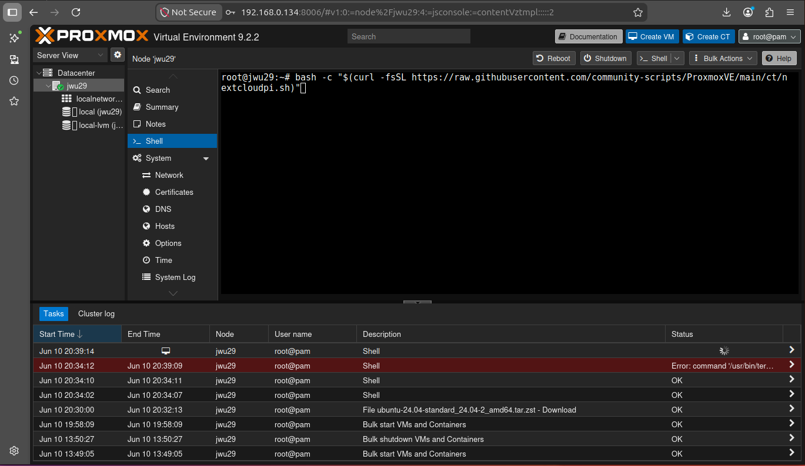

Back in the Proxmox node shell, the correct `cURL`-based install command is run:

```
bash -c "$(curl -fsSL https://raw.githubusercontent.com/community-scripts/ProxmoxVE/main/ct/nextcloudpi.sh)"
```

The task log at the bottom of the screen shows the previous `wget` shell session (Jun 10 20:34:12–20:39:09) ended with an error, confirming why we switched approach. The current shell session (Jun 10 20:39:14) is now running the `cURL` command successfully, launching the interactive Proxmox VE Helper Scripts installer.

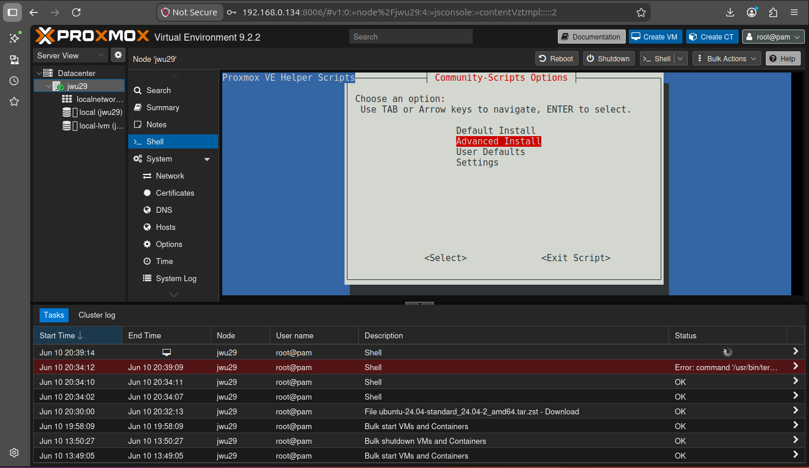

The installer presents a **Community Scripts Options** menu. Using the arrow keys, **Default Install** is highlighted and selected — this installs NextcloudPi with sensible defaults without requiring manual configuration of every parameter. An **Advanced** option is also available for those who wish to customise the setup further.

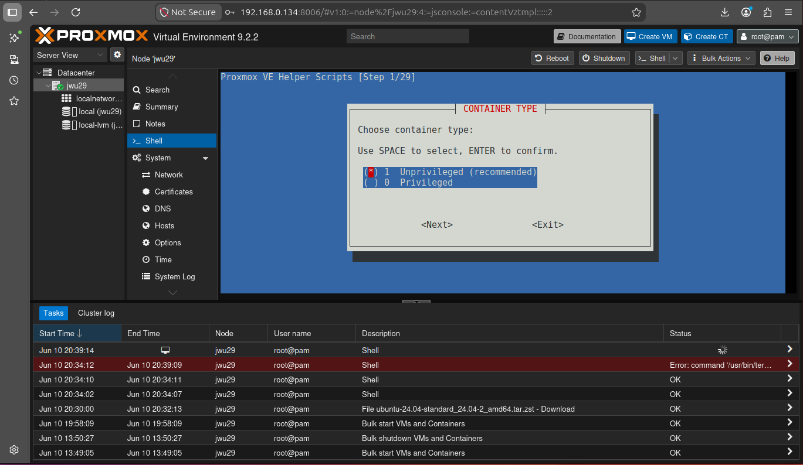

The next prompt asks for the **Container Type**. Here, we went with "Unprivileged (Recommended)". This mirrors the security configuration chosen in the GUI wizard earlier, ensuring the container runs with a remapped UID/GID namespace for an additional layer of isolation.

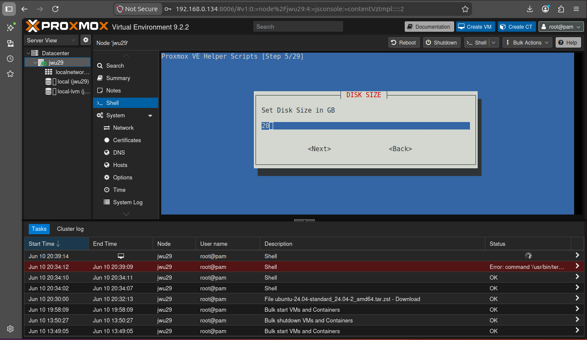

At one of the steps, the installer prompts for the **Disk Size** in gigabytes. We decided to go with 20GB of storage, as it provides sufficient storage for the NextcloudPi application files and initial data whilst keeping the footprint manageable on the local-lvm volume.


Next, the installer asks how much RAM to allocate in MiB. `4096` MiB (4 GB) is entered, giving NextcloudPi enough memory to handle file syncing, background jobs, and web requests without contention.

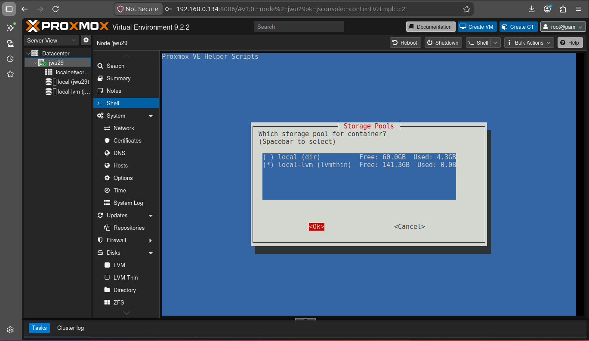

The installer then asks which **Storage Pool** to use for the container. Two options are available: `local (dir)` with 60.0 GB free and `local-lvm (lvmthin)` with 141.3 GB free. The `local-lvm` thin-provisioned pool is selected, as it offers significantly more available space and benefits from LVM's efficient block-level storage management.

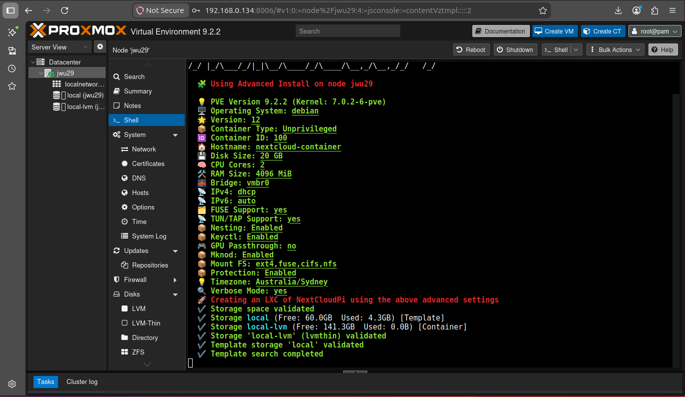

The Proxmox VE Helper Scripts installer completes successfully. The output confirms the full environment details: Proxmox VE 9.2.2, a Debian-based operating system for the container, an unprivileged LXC container type, and the storage allocated to `local-lvm`. The template search confirms the `local` storage pool was used to source the OS template, and the container creation task finishes cleanly — NextcloudPi is now provisioned and ready.

## Conclusion

This part of the series covered the end-to-end provisioning of a NextcloudPi LXC container on the Proxmox VE host. The key achievements of this stage are as follows:

- **Storage confirmed**: The Proxmox node was verified to have two healthy storage pools — a `local` directory store and a `local-lvm` thin-provisioned volume — providing the foundation for container and data storage.
- **Ubuntu 24.04 template acquired**: The official Ubuntu Server 24.04.2 LTS template was downloaded directly from Proxmox's mirror and cached locally, making it available for container provisioning.
- **LXC container configured securely**: The container was set up as an unprivileged container with nesting enabled — ensuring a strong security boundary whilst supporting the Docker workloads planned for later parts of this series.
- **NextcloudPi installed via community script**: Rather than a manual installation, the Proxmox VE Helper Scripts one-liner was used to automate the provisioning process, stepping through 29 configuration prompts covering container type, disk size (20 GB), RAM allocation (4 GB), and storage pool selection (`local-lvm` with 141.3 GB free).
- **Container running**: By the end of this part, a fully provisioned NextcloudPi LXC container is live on the Proxmox host, ready to be configured and secured in the subsequent parts of this series.

In the next part (Part 3), we will look to setup Docker to host Nextcloud. See you in the next part!

---
