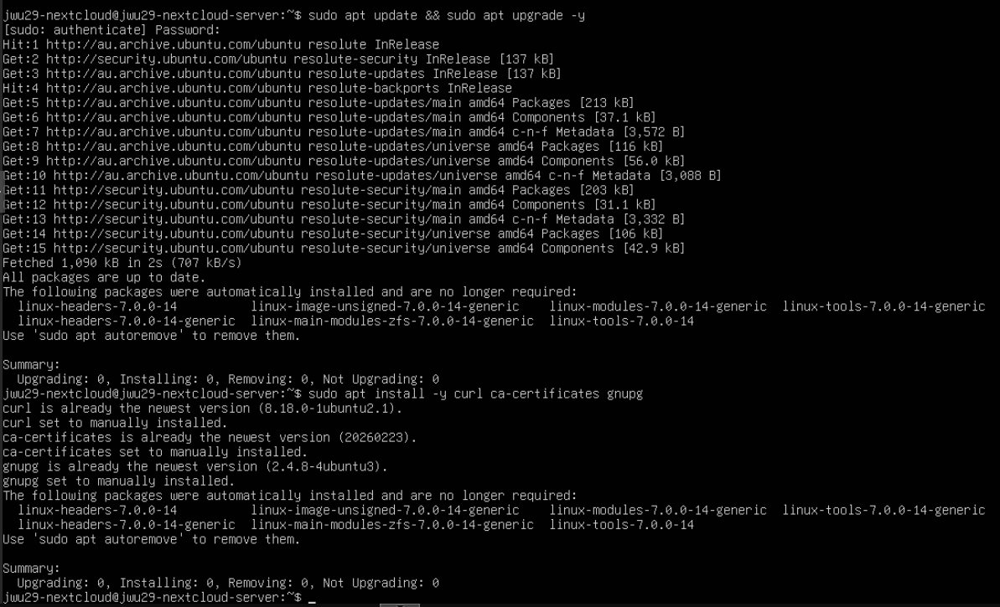
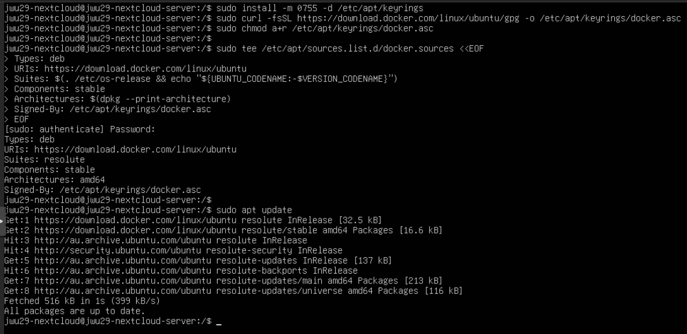
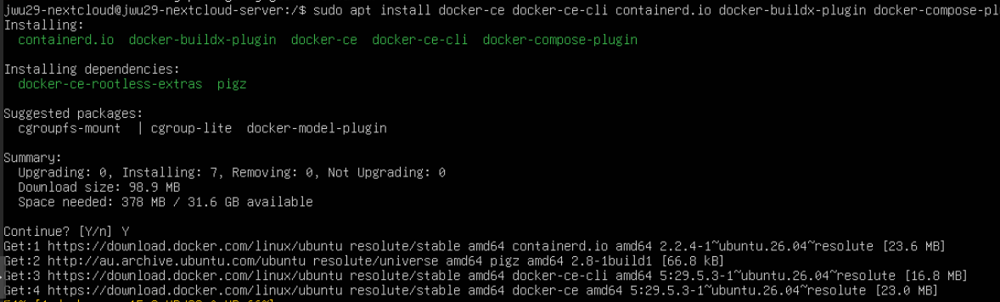
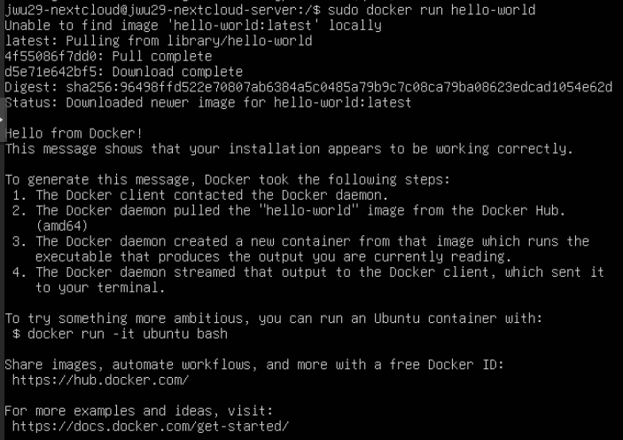
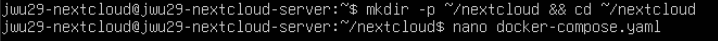
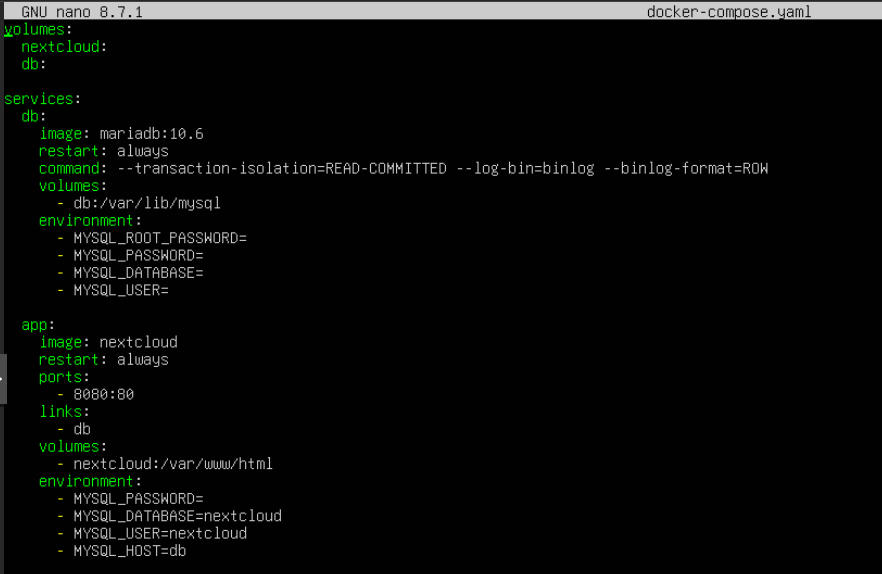
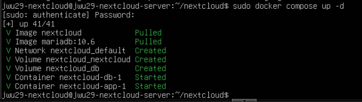
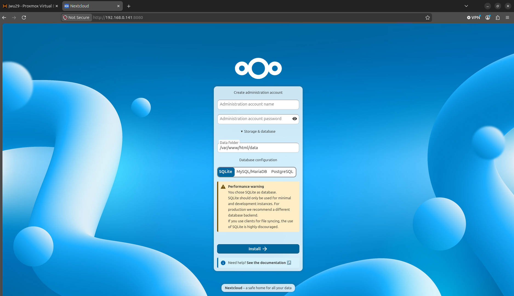
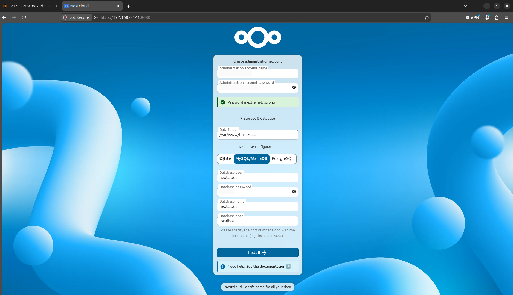
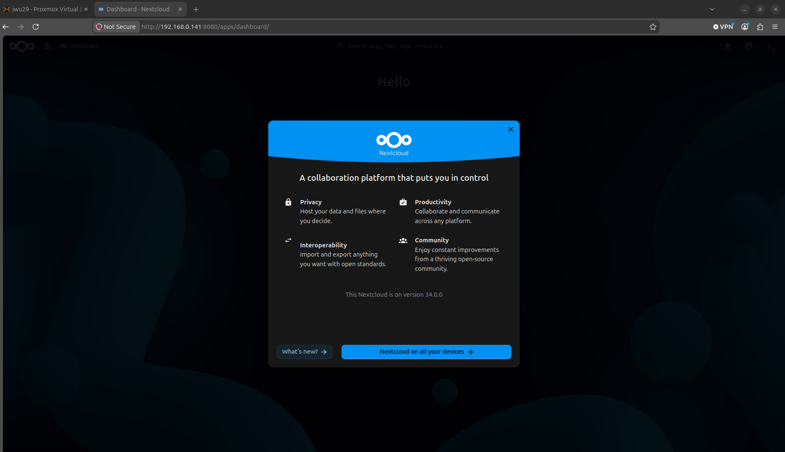

## Introduction

Hello everyone! This is Part 3 of a series of articles documenting my Private Cloud home lab, which will be divied into different parts.

1. Hardware Equipment Setup; Proxmox Server Installation
2. Creating NextcloudPi LXC Container
3. _YOU ARE HERE!_ Setting up Docker hosting Nextcloud
4. Access Control using Tailscale VPN
5. On-Premise and AWS Storage Backup

In this home lab project, I have built a private cloud hosted on a Docker LXC Container in Proxmox OS. This private cloud can only connected using a VPN, with additional access controls so that only my personal devices have access. The storage in the private cloud has multiple backups, one on a SSD flash drive mounted on a Proxmox Server, and another on the public cloud (AWS S3).

## Back to Ubuntu Server...

Picking up from Part 2, we are back inside the Ubuntu Server LXC container (`jwu29-nextcloud@jwu29-nextcloud-server`). Before installing any new software, it is good practice to refresh the package lists and upgrade all existing packages. Running `sudo apt update && sudo apt upgrade -y` ensures the system is fully up to date and that any security patches or dependency changes are applied before we proceed with the Docker installation.

With the system updated, we add Docker's official APT repository. This involves installing the prerequisite packages (`ca-certificates` and `curl`), creating the `/etc/apt/keyrings/` directory, downloading Docker's GPG signing key, and registering the Docker repository in the system's APT sources list. Running `sudo apt update` afterwards ensures the new repository is indexed and its packages are available for installation.

With the repository configured, we install the full Docker stack in a single command: `sudo apt install docker-ce docker-ce-cli containerd.io docker-buildx-plugin docker-compose-plugin`. The package manager resolves 7 packages to install — including `docker-ce-rootless-extras` and `pigz` — downloading approximately 98.9 MB in total. The installation requires 378 MB of disk space, well within the 31.6 GB available on the container.

To verify that Docker is installed and functioning correctly, we run `sudo docker run hello-world`. Docker pulls the `hello-world` image from Docker Hub, creates a container from it, and the executable prints the classic confirmation message: "Hello from Docker!" — along with a step-by-step explanation of the four actions Docker took to produce that output. This installation step is to confirm that Docker is working correctly.

## Configure Docker to host Nextcloud

With Docker installed and verified, we begin setting up the Nextcloud environment. A dedicated working directory is created with `mkdir -p ~/nextcloud && cd ~/nextcloud`, and the `docker-compose.yaml` configuration file is opened for editing using `nano docker-compose.yaml`.

The `docker-compose.yaml` file defines two services and two named volumes. The `db` service uses the `mariadb:10.6` image, configured with recommended transaction isolation and binary logging settings, and is given its own `db` volume mounted at `/var/lib/mysql`. The `app` service uses the official `nextcloud` image, exposes port `8080` on the host (mapped to port `80` inside the container), and links to the `db` service. Both services are set to `restart: always`, ensuring they recover automatically after any reboot or crash. Environment variables wire the two containers together, sharing the database name, user, and password credentials.

Running `sudo docker compose up -d` brings the entire stack online in detached mode. Docker pulls both the `nextcloud` and `mariadb:10.6` images, creates the `nextcloud_default` network, provisions the `nextcloud_nextcloud` and `nextcloud_db` volumes, and starts both containers — `nextcloud-db-1` and `nextcloud-app-1`.

With both containers running, the Nextcloud web interface is now accessible in a browser. The initial setup page presents a form to create an administrator account, configure the data folder path, and choose a database backend. Notably, a performance warning flags that "SQLite is not suitable for production use" — we will select MySQL/MariaDB instead, which we have already provisioned via the `db` container.

The setup form is completed with the administrative details. Under database configuration, MySQL/MariaDB is selected as the backend, and the credentials defined in `docker-compose.yaml` are entered: the database user, password, and database name `nextcloud`. The database host is set to `db`, which Docker resolves to the `nextcloud-db-1` container via the internal network link.

After clicking "Install", Nextcloud completes its setup and presents the welcome screen at an address. A greeting modal introduces Nextcloud 34.0.0 as a "collaboration platform that puts you in control", highlighting its four core values: **Privacy** (host your data where you decide), **Productivity** (collaborate across any platform), **Interoperability** (open standards for import and export), and **Community** (a thriving open-source ecosystem). Nextcloud is now fully operational.

## Conclusion

This part of the series covered the installation of Docker on the Ubuntu Server LXC container provisioned in Part 2, and the deployment of a fully containerised Nextcloud instance. The key achievements of this stage are as follows:

- **System prepared**: The Ubuntu Server LXC container was brought fully up to date via `apt update && apt upgrade`, ensuring a clean baseline before any new software was introduced.
- **Docker installed from the official repository**: Rather than relying on Ubuntu's default package mirrors, Docker's official APT repository was added and the complete Docker stack was installed — including `docker-ce`, `docker-ce-cli`, `containerd.io`, `docker-buildx-plugin`, and `docker-compose-plugin`.
- **Docker verified**: The `hello-world` container was run successfully, confirming the Docker daemon, image pulling, and container execution pipeline are all functioning correctly.
- **Nextcloud stack defined with Docker Compose**: A `docker-compose.yaml` file was written to define two linked services — a `mariadb:10.6` database container and the official `nextcloud` application container — along with named volumes for persistent storage and environment variables to wire the services together.
- **Nextcloud deployed and accessible**: Running `sudo docker compose up -d` brought both containers online. Nextcloud 34.0.0 was successfully configured with MySQL/MariaDB selected as the database backend and the administrator account created.

In the next part (Part 4), we will look to secure access to our Nextcloud instance using Tailscale VPN. See you in the next part!

---
