## Introduction

Hello everyone! This is Part 4 of a series of articles documenting my Private Cloud home lab, which will be divied into different parts.

1. Hardware Equipment Setup; Proxmox Server Installation
2. Creating NextcloudPi LXC Container
3. Setting up Docker hosting Nextcloud
4. _YOU ARE HERE!_ Access Control using Tailscale VPN
5. On-Premise and AWS Storage Backup

In this home lab project, I have built a private cloud hosted on a Docker LXC Container in Proxmox OS. This private cloud can only connected using a VPN, with additional access controls so that only my personal devices have access. The storage in the private cloud has multiple backups, one on a SSD flash drive mounted on a Proxmox Server, and another on the public cloud (AWS S3).

## Setting up Private VPN access to our Nextcloud

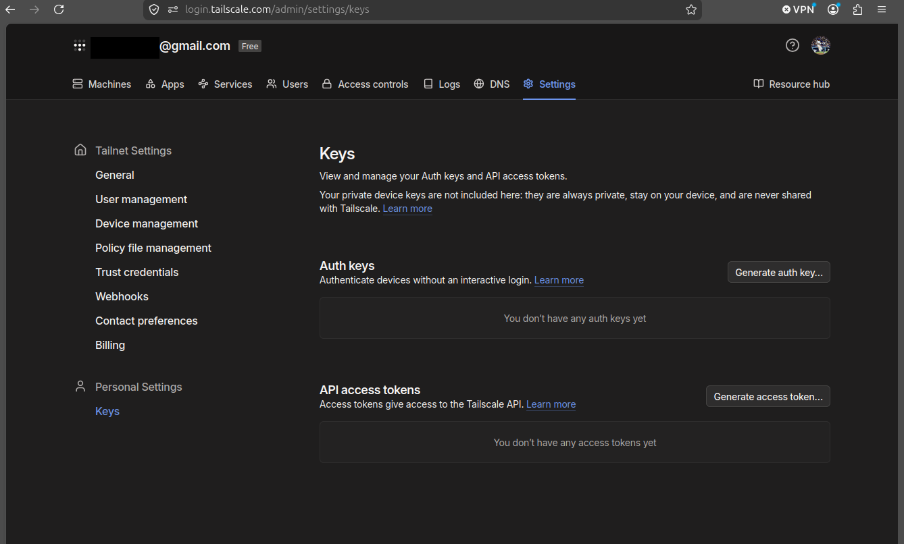

Picking up from Part 3, we have a fully operational Nextcloud instance running — but it is only reachable from within the local network. To access it securely from anywhere, we will use **Tailscale**, a zero-config VPN built on WireGuard. Navigating to the "Settings -> Keys" section of the Tailscale admin console at `login.tailscale.com`, we can see that no auth keys exist yet. Auth keys allow us to authenticate devices into our tailnet without requiring an interactive browser login — exactly what we need to enrol the Nextcloud container programmatically.

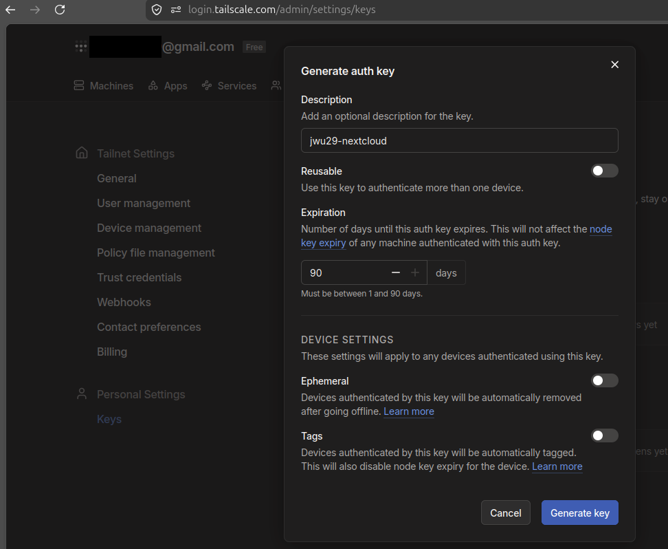

Clicking "Generate auth key" opens a creation modal. We give the key the description `jwu29-nextcloud` to identify its purpose, leave `Reusable` disabled (this key will only be used once), and set the `Expiration` to the maximum of 90 days. The `Ephemeral` and `Tags` options are left off for now. Clicking `Generate key` produces the `TS_AUTHKEY` token we will embed into our Docker Compose configuration.

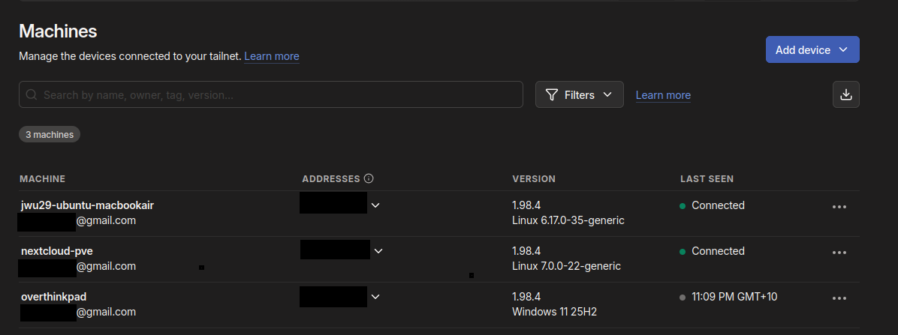

Before modifying the Docker stack, we can inspect the current state of our `Tailscale Machines` page. Three devices are already enrolled in our tailnet: `jwu29-ubuntu-macbookair`, `nextcloud-pve`, and `overthinkpad`. Both `jwu29-ubuntu-macbookair` and `nextcloud-pve` show as Connected. We will shortly move Tailscale into the Docker Compose stack itself, so that the Nextcloud application container shares the VPN tunnel directly.

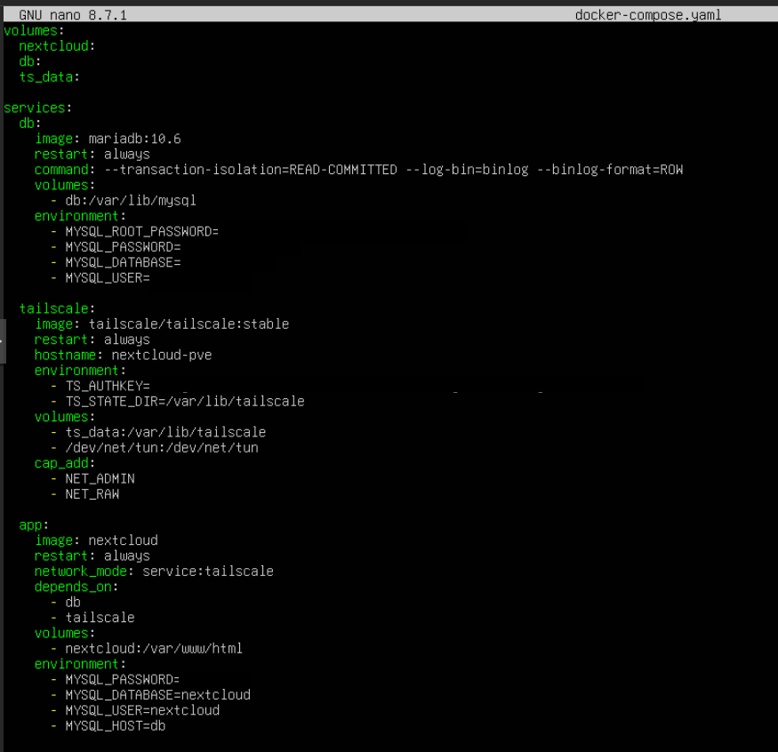

We update `docker-compose.yaml` to introduce Tailscale as a sidecar container. A new `tailscale` service is added using the official `tailscale/tailscale:stable` image, with its hostname set to `nextcloud-pve`. The `TS_AUTHKEY` environment variable is populated with the auth key generated above, and `TS_STATE_DIR` is pointed at `/var/lib/tailscale`. A new `ts_data` named volume is mounted at that path to persist the Tailscale node identity across restarts. The `/dev/net/tun` device is bind-mounted in, and the `NET_ADMIN` and `NET_RAW` Linux capabilities are granted — both required for Tailscale to manage network interfaces.

Crucially, the `app` (Nextcloud) service is updated to use `network_mode: service:tailscale`, which routes all of its network traffic through the Tailscale container's network namespace. This means Nextcloud is no longer directly accessible on the host network; it is only reachable via the tailnet IP assigned to the `tailscale` sidecar.

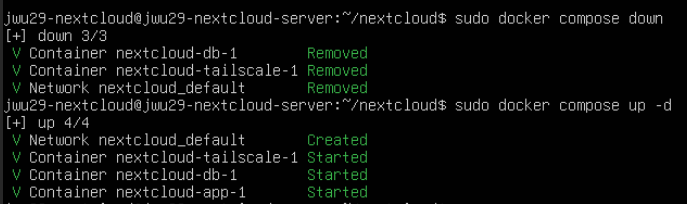

With the configuration updated, we bring the stack down with `sudo docker compose down` — removing the three existing containers and the `nextcloud_default` network — then bring it back up with `sudo docker compose up -d`. This time, Docker starts four services: the `nextcloud_default` network, the `tailscale` container, the `db` container, and the `app` container, all confirming `[+] up 4/4`.

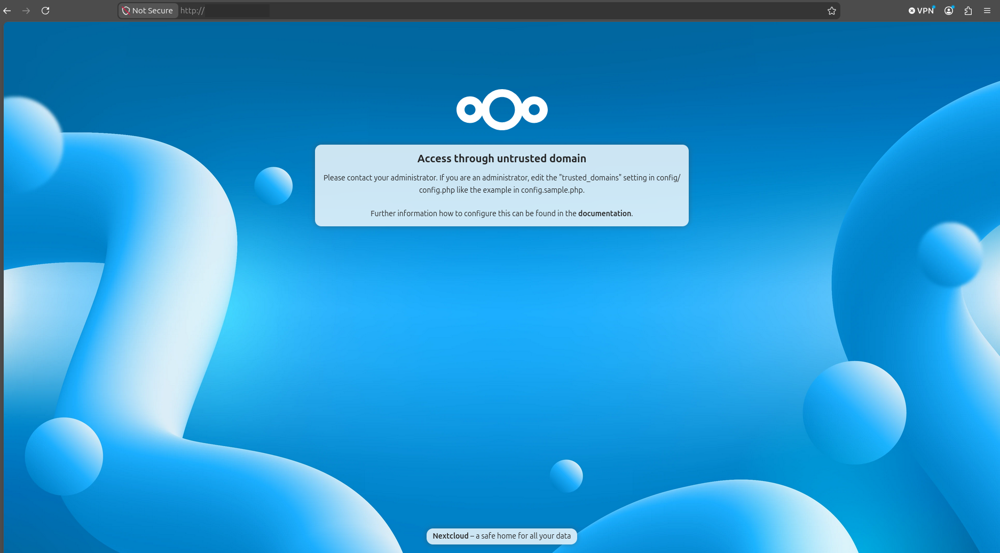

Navigating to the Tailscale IP in a browser confirms that Nextcloud is now reachable over the VPN — but we are greeted with an "Access through untrusted domain" error. Nextcloud maintains a `trusted_domains` allowlist in its configuration file, and the new Tailscale IP has yet to be added onto that list.

## Update Trusted Domains

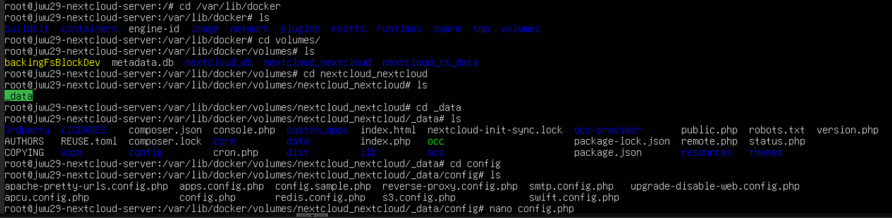

To resolve this, we need to edit Nextcloud's `config.php` file, which lives inside the Docker volume. Navigating to `/var/lib/docker/volumes/`, we find the volumes created by our stack: `nextcloud_db`, `nextcloud_nextcloud`, and `nextcloud_ts_data`. Descending into `nextcloud_nextcloud/_data/config/`, we find a collection of PHP configuration files and open `config.php` for editing using `nano`.

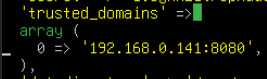

Inside `config.php`, the `trusted_domains` array currently contains only the original local network address of the Proxmox Server. Any request arriving from a hostname or IP not listed here will be rejected by Nextcloud with the untrusted domain error we observed.

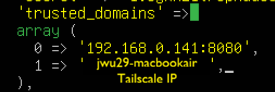

We add the Tailscale IP of our management device (`jwu29-macbook-air`) as a second entry. With both the LAN address and the tailnet address now listed, Nextcloud will accept connections arriving via either route.

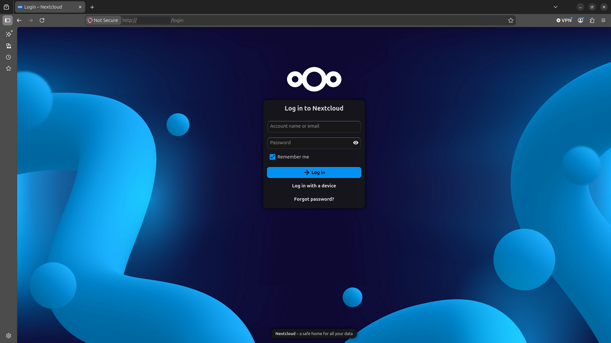

After saving the file, refreshing the browser now loads the Nextcloud login page correctly. The "Access through untrusted domain" error is gone — Nextcloud recognises the Tailscale IP as a trusted host and renders the full interface.

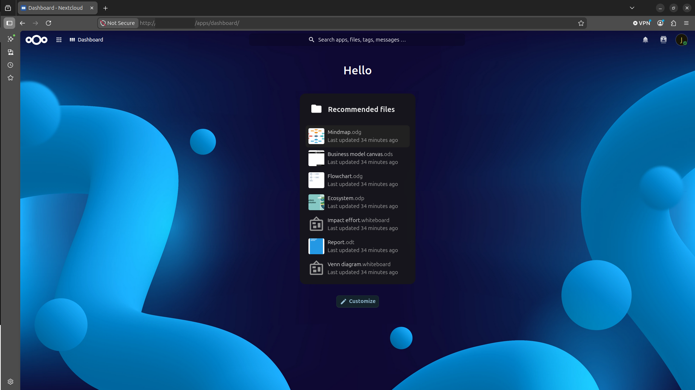

Logging in with the administrator credentials brings up the Nextcloud Dashboard. The instance is now fully accessible over Tailscale VPN — the same Nextcloud we deployed in Part 3, now reachable securely from any enrolled device, regardless of physical location.

## Enable Tags for Access Control in Tailscale

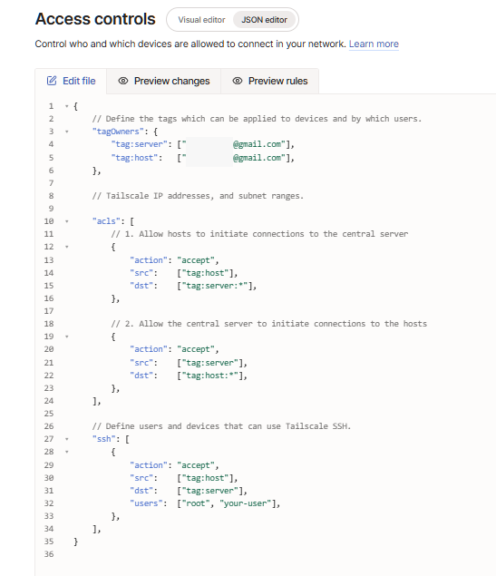

With Nextcloud accessible over Tailscale, the next step is to enforce **access control** so that not every device on the tailnet can communicate freely with every other. In the Tailscale admin console under "Access controls", we edit the policy file in JSON mode to define two logical roles: `tag:server` (for the Nextcloud host) and `tag:host` (for personal client devices).

Two ACL rules are defined: the first allows any machine tagged `tag:host` to initiate connections to any port on machines tagged `tag:server`; the second allows the server to initiate connections back to the hosts. An SSH rule is also added, permitting `tag:host` machines to SSH into `tag:server` as `root` or a named user. This policy ensures that inter-device traffic between personal machines is blocked by default — only host-to-server and server-to-host communication is permitted.

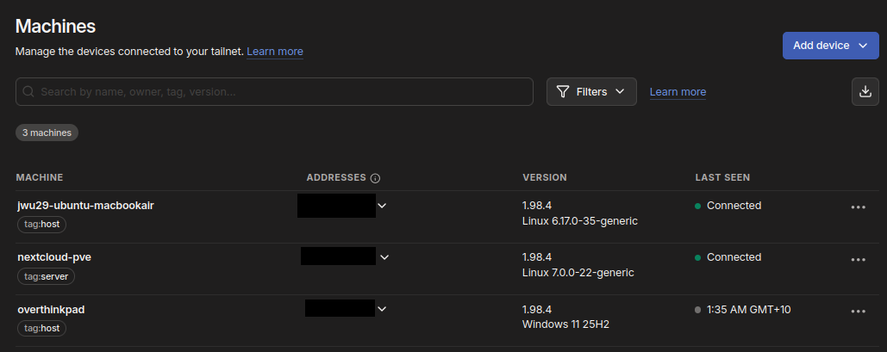

After saving the policy, we apply the tags to each machine in the "Machines" page. `nextcloud-pve` is assigned `tag:server`, whilst both `jwu29-ubuntu-macbookair` and `overthinkpad` are assigned `tag:host`. The tags are now visible beneath each machine name in the dashboard.

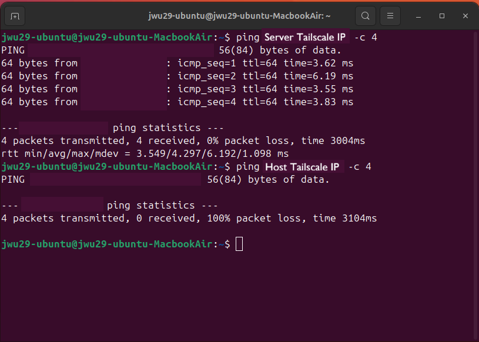

To verify the ACL policy is working as intended, we run connectivity tests from `jwu29-ubuntu@jwu29-ubuntu-MacbookAir`. Pinging the Nextcloud server succeeds: all 4 packets are returned with 0% packet loss and an average round-trip time of ~4.3 ms. Pinging the other host (`overthinkpad`) results in 100% packet loss\*\* — the ACL policy is correctly blocking direct host-to-host communication, whilst permitting host-to-server traffic.

## Enable AWS Policy for Access Control in AWS (Used later in Part 5!)

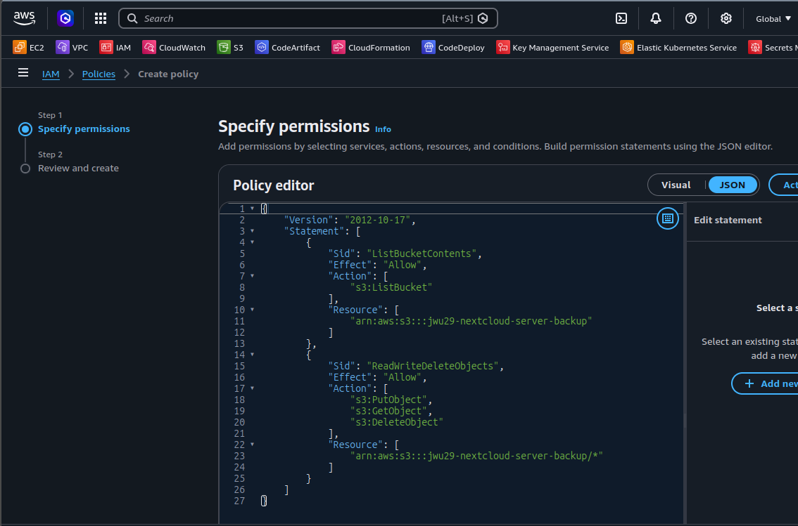

Looking ahead to Part 5, where we will configure Nextcloud to back up its data to an AWS S3 bucket, we set up the necessary AWS IAM permissions now. In the IAM console, we create a custom policy using the JSON editor. The policy contains two statements: `ListBucketContents`, which grants `s3:ListBucket` permission on the bucket `arn:aws:s3:::jwu29-nextcloud-server-backup`; and `ReadWriteDeleteObjects`, which grants `s3:PutObject`, `s3:GetObject`, and `s3:DeleteObject` on all objects within the bucket. This follows the **principle of least privilege** — the credentials we generate will only be able to interact with this specific bucket, and nothing else in AWS.

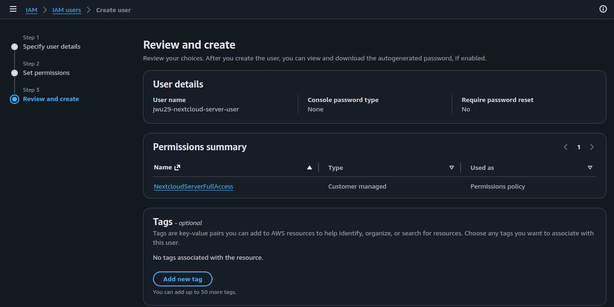

With the policy defined, we create a dedicated IAM user named `jwu29-nextcloud-server-user` with no console access. On the **Review and create** screen, the permissions summary confirms that the `NextcloudServerFullAccess` customer-managed policy has been attached. This user will be used in Part 5 to generate programmatic access keys, which Nextcloud will use to authenticate against S3.

## Conclusion

In the previous part, we deployed a fully containerised Nextcloud instance accessible on the local network. This part built upon that foundation by securing and controlling access to the server using Tailscale VPN and AWS IAM. The key achievements of this stage are as follows:

- **Tailscale integrated as a Docker sidecar**: Rather than running Tailscale at the host level, it was embedded directly into the Docker Compose stack as a dedicated sidecar container. The Nextcloud `app` service was configured to share the Tailscale container's network namespace via `network_mode: service:tailscale`, ensuring all traffic to and from Nextcloud is routed exclusively through the VPN tunnel.
- **Nextcloud accessible over VPN**: Following the addition of the Tailscale IP to Nextcloud's `trusted_domains` list in `config.php`, the instance became fully accessible from any enrolled device without exposing any ports to the public internet.
- **Tag-based access control enforced in Tailscale**: A custom ACL policy was written in the Tailscale admin console, introducing two roles — `tag:server` and `tag:host`. The policy permits host-to-server and server-to-host communication whilst blocking direct host-to-host traffic. Connectivity tests confirmed that a `tag:host` device can reach the Nextcloud server but cannot reach other `tag:host` devices.
- **Least-privilege AWS IAM credentials prepared**: A custom IAM policy (`NextcloudServerFullAccess`) was created, granting `s3:ListBucket`, `s3:PutObject`, `s3:GetObject`, and `s3:DeleteObject` permissions scoped exclusively to the S3 bucket. A dedicated IAM user was created with this policy attached, which plays an important role when we implement AWS backups in Part 5.

In the final part (Part 5), we will use these AWS credentials to configure on-premise and cloud storage backups for our private Nextcloud instance. See you in the next part!

---
