## Introduction


Hello everyone! This is Part 5 (final part!) of a series of articles documenting my Private Cloud home lab, which will be divied into different parts.

1. Hardware Equipment Setup; Proxmox Server Installation
2. Creating NextcloudPi LXC Container
3. Setting up Docker hosting Nextcloud
4. Access Control using Tailscale VPN
5. _YOU ARE HERE!_ On-Premise and AWS Storage Backup

In this home lab project, I have built a private cloud hosted on a Docker LXC Container in Proxmox OS. This private cloud can only connected using a VPN, with additional access controls so that only my personal devices have access. The storage in the private cloud has multiple backups, one on a SSD flash drive mounted on a Proxmox Server, and another on the public cloud (AWS S3).

## Mounting External SSD as Backup

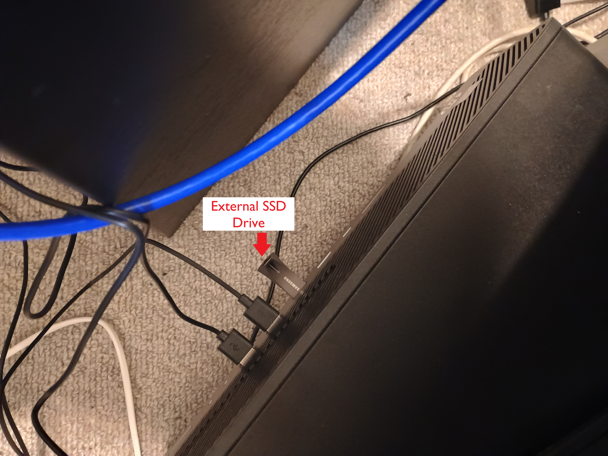

We will first plug in our External SSD Drive into the USB port of our Mini PC. This will act as our on-premise backup storage device.

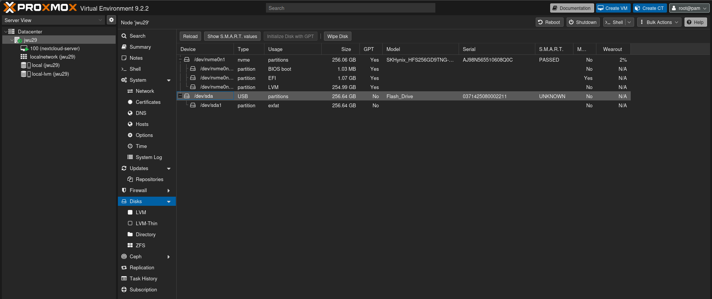

Navigating to the **Disks** section of the Proxmox VE dashboard under the `jwu29` node, we can see two physical disks recognised by the host. The first, `/dev/nvme0n1`, is the internal 256.06 GB SKHynix NVMe drive that holds the BIOS boot, EFI, and LVM partitions used by Proxmox itself — it passes S.M.A.R.T. diagnostics cleanly at only 2% wearout. The second device, `/dev/sda`, is our newly attached external USB flash drive (256.64 GB, model `Flash_Drive`), currently containing a single exFAT partition (`/dev/sda1`). Before we can use this drive as a Linux-native backup target, the existing exFAT partition must be cleared and the disk reformatted.

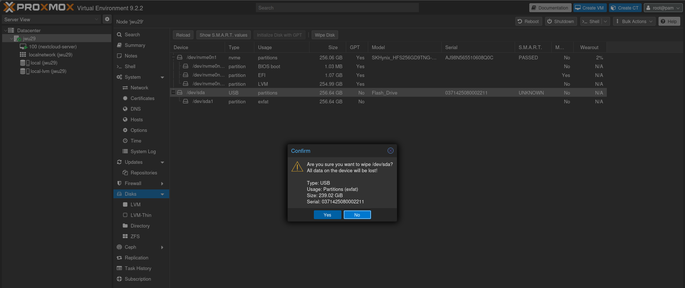

Selecting `/dev/sda` and clicking **Wipe Disk** raises a confirmation dialogue: "Are you sure you want to wipe /dev/sda? All data on the device will be lost!" — the details confirm it is a 239.02 GiB USB device. Clicking **Yes** erases all partition data on the drive, leaving it unpartitioned and ready to be formatted as a Proxmox Directory storage backend.

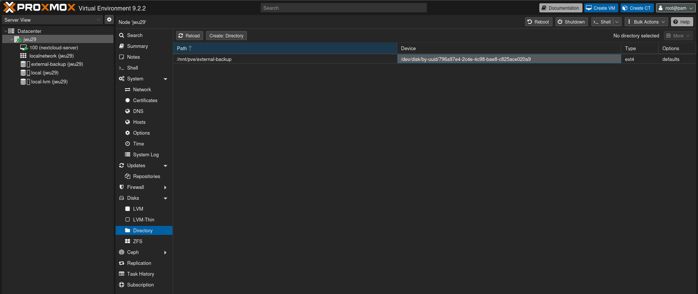

With the drive wiped, we register it in Proxmox as a **Directory** storage backend. The resulting storage entry — named `external-backup (jwu29)` — is now listed in the left-hand sidebar alongside the existing `local` and `local-lvm` storages. The **Directory** view confirms the mount point `/mnt/pve/external-backup` is mapped to the device by a UUID, formatted as `ext4` with `defaults` mount options. Referencing the disk by UUID rather than by its device path (`/dev/sda`) ensures the correct drive is always mounted even if the device enumeration changes between reboots.

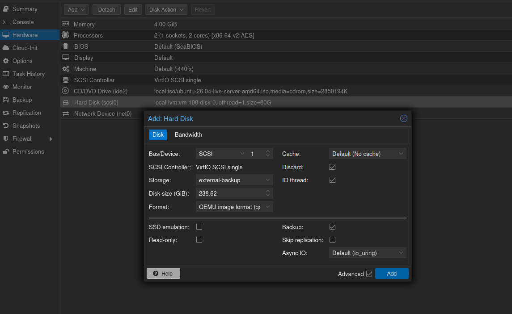

Now we attach the external storage directly to the Nextcloud VM (VM 100, `nextcloud-server`) via the Proxmox **Hardware** tab. Clicking **Add → Hard Disk** opens the configuration modal. The disk is attached as a SCSI device (`scsi1`) using the `VirtIO SCSI single` controller, sourced from the `external-backup` storage directory, at a size of 238.62 GiB in QEMU image format (`qcow2`). **Discard** and **IO thread** are both enabled for performance, and **Backup** is ticked so that Proxmox snapshots also capture this disk.

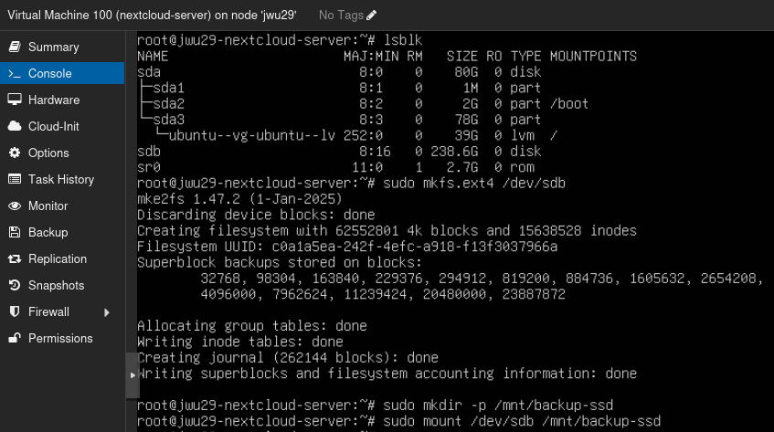

Inside the `nextcloud-server` VM console, running `lsblk` confirms the new disk has been recognised as `/dev/sdb` (238.6 GB), alongside the existing boot disk `/dev/sda` and the CD-ROM `/dev/sr0`. We format the new disk as ext4 with `sudo mkfs.ext4 /dev/sdb`, which creates the filesystem. A mount point is then created at `/mnt/backup-ssd` with `sudo mkdir -p /mnt/backup-ssd`, and the disk is mounted immediately with `sudo mount /dev/sdb /mnt/backup-ssd`.

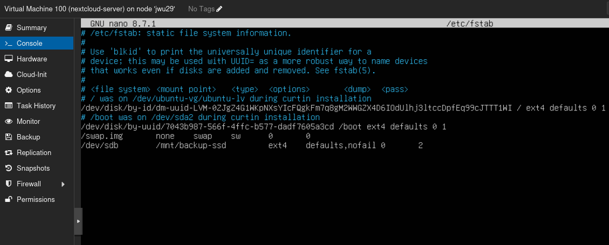

To ensure the backup SSD is remounted automatically on every reboot, we add a persistent entry to `/etc/fstab` using `nano`. The new line at the bottom of the file reads:

```
/dev/sdb    /mnt/backup-ssd    ext4    defaults,nofail    0    2
```

The `nofail` option is extremely important: it instructs the boot process to continue even if this device is not present, preventing the VM from hanging at startup should the disk ever be unavailable.

## On-Premises Backup: on External SSD

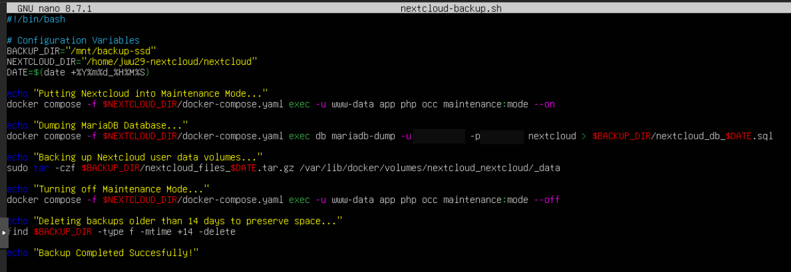

We write a Bash script, `nextcloud-backup.sh`, to automate the entire backup process. Three configuration variables are defined at the top: `BACKUP_DIR` (the SSD mount point at `/mnt/backup-ssd`), `NEXTCLOUD_DIR` (the Docker Compose project at `/home/jwu29-nextcloud/nextcloud`), and `DATE` (a timestamp in `YYYYmmdd_HHMMSS` format for uniquely naming each backup). The script then performs the following steps in sequence:

1. **Enable Maintenance Mode** — Nextcloud is placed into maintenance mode via `docker compose exec`, pausing user access and preventing writes during the backup window.
2. **Dump the MariaDB database** — A full SQL dump of the `nextcloud` database is written to `$BACKUP_DIR/nextcloud_db_$DATE.sql`.
3. **Archive the Nextcloud data volume** — The Docker volume at `/var/lib/docker/volumes/nextcloud_nextcloud/_data` is compressed into a `.tar.gz` archive at `$BACKUP_DIR/nextcloud_files_$DATE.tar.gz`.
4. **Disable Maintenance Mode** — Nextcloud is brought back online.
5. **Prune old backups** — Files older than 14 days in `$BACKUP_DIR` are automatically deleted to conserve disk space.

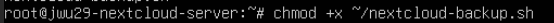

Before the script can be executed, it must be made executable. Running `chmod +x ~/nextcloud-backup.sh` grants the owner execute permission on the file.

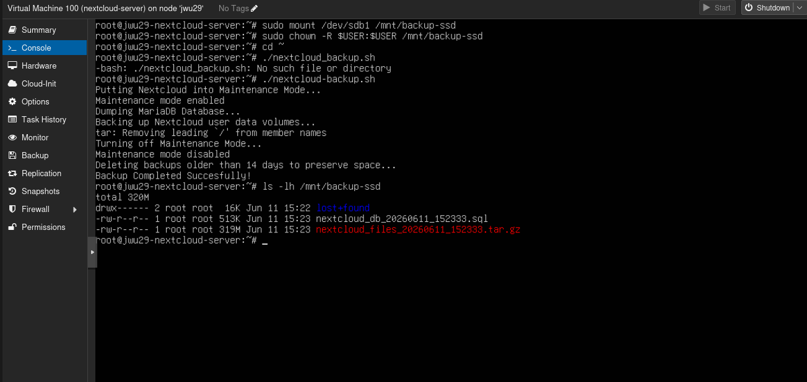

On the first attempt, the script is invoked with a typo — `./nextcloud_backup.sh` (underscore instead of a hyphen) — resulting in a "No such file or directory" error. Correcting the filename to `./nextcloud-backup.sh`, the script runs successfully: maintenance mode is enabled, the MariaDB dump completes, the Nextcloud data volume is archived (with `tar` noting it is stripping the leading `/` from member names, as is standard practice), and maintenance mode is disabled. A final `ls -lh /mnt/backup-ssd` confirms two files have been written: a `.sql` file and a `.tar.gz` archive.

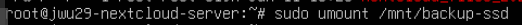

The SSD is safely unmounted with `sudo umount /mnt/backup-ssd` so that it can be physically removed and inspected from a separate machine.

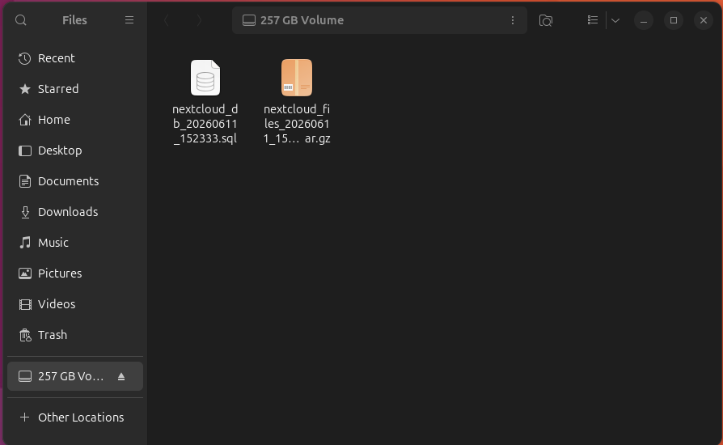

Plugging the external drive into a separate computer and opening the file manager confirms the backup was written correctly. The "257 GB Volume" appears in the sidebar and contains exactly the two expected files: the `.sql` database dump and the `.tar.gz` data archive, both timestamped from the backup run.

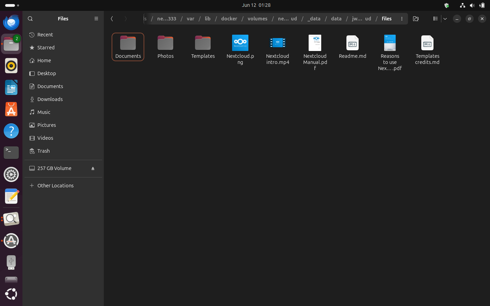

To verify the integrity of the archive, the `.tar.gz` file is extracted and its contents inspected. Navigating into the decompressed path — `/var/lib/docker/volumes/nextcloud_nextcloud/_data/data/jwu29-nextcloud/files` — reveals the full Nextcloud user file tree. The backup is therefore confirmed to be a faithful, complete snapshot of the Nextcloud data volume.

### Testing Backup on changes in files

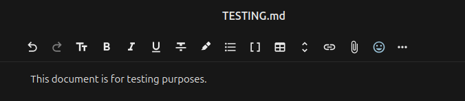

To verify that the backup script correctly captures incremental changes, we create a new test file — `TESTING.md` — containing the single line "This document is for testing purposes." This file serves as a canary: after uploading it to Nextcloud and running a fresh backup, we will inspect the resulting archive to confirm the new file is present.

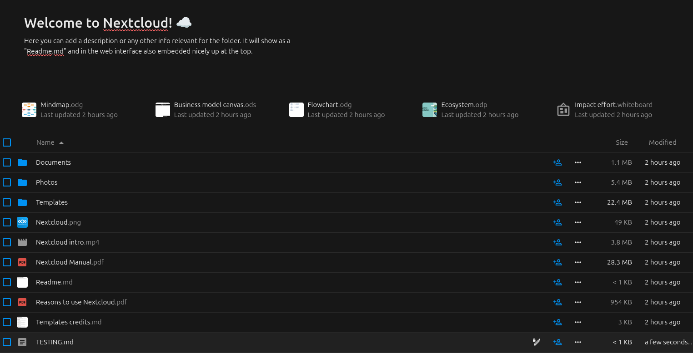

`TESTING.md` is uploaded to the root of the Nextcloud file tree via the web interface. It immediately appears at the bottom of the file list with a size of less than 1 KB and a modified timestamp of "a few seconds ago", confirming the file has been written to the Nextcloud data volume.

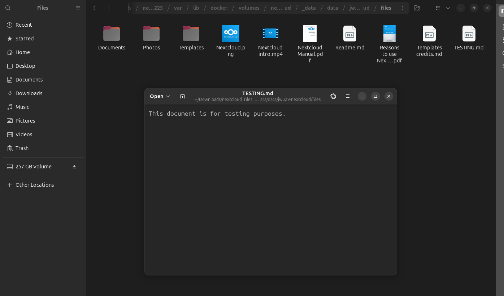

A second backup run is executed and the resulting `.tar.gz` archive is extracted to verify its contents. Navigating to the same `jwu29-nextcloud/files` path within the decompressed archive, `TESTING.md` is now present alongside all previously existing files. The backup correctly captured the change, confirming the script reliably reflects the current state of the Nextcloud data on every run.

### Automatic Backup via crontab

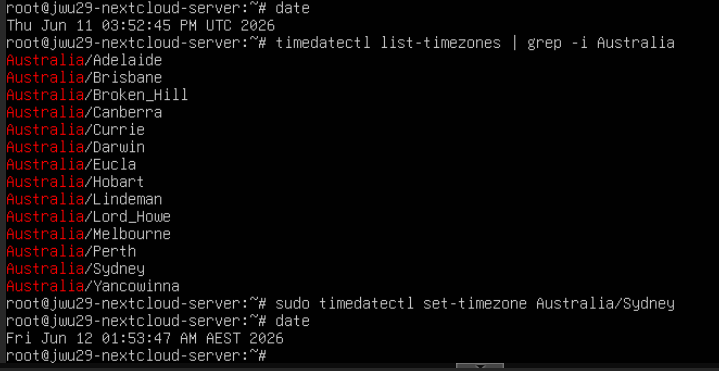

Before scheduling the backup, we ensure the system clock is set to the correct local timezone. Running `date` initially shows the server is set to UTC (`Tue Jun 11 03:52:45 PM UTC 2026`). We run `timedatectl list-timezones | grep -i Australia` to locate the appropriate timezone identifier, then apply it with `sudo timedatectl set-timezone Australia/Sydney`. A second `date` call confirms the change: the clock now reads `Fri Jun 12 01:53:47 AM AEST 2026`. This ensures that cron jobs scheduled by local time will fire at the expected hour.

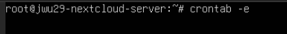

The root user's crontab is opened for editing with `crontab -e`, which launches the crontab file in the default text editor.

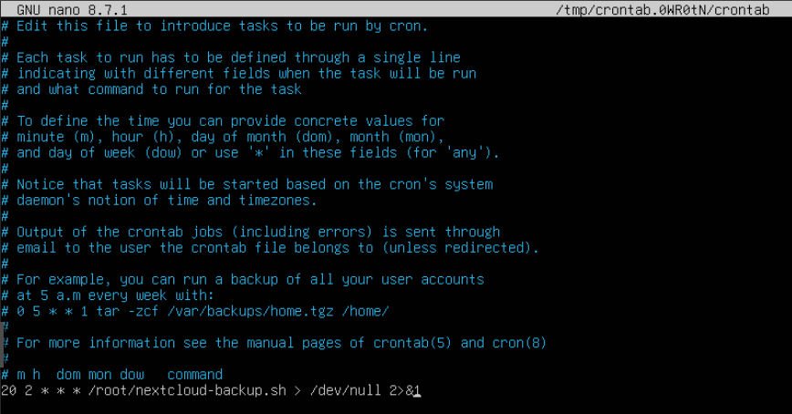

A single cron entry is added at the bottom of the file:

```
20 2 * * * /root/nextcloud-backup.sh > /dev/null 2>&1
```

This schedules the backup script to run automatically at **02:20 AEST every night**. Both standard output and standard error are redirected to `/dev/null` to suppress spurious email notifications. The script is referenced by its absolute path (`/root/nextcloud-backup.sh`) to ensure cron can locate it regardless of the working directory at execution time.

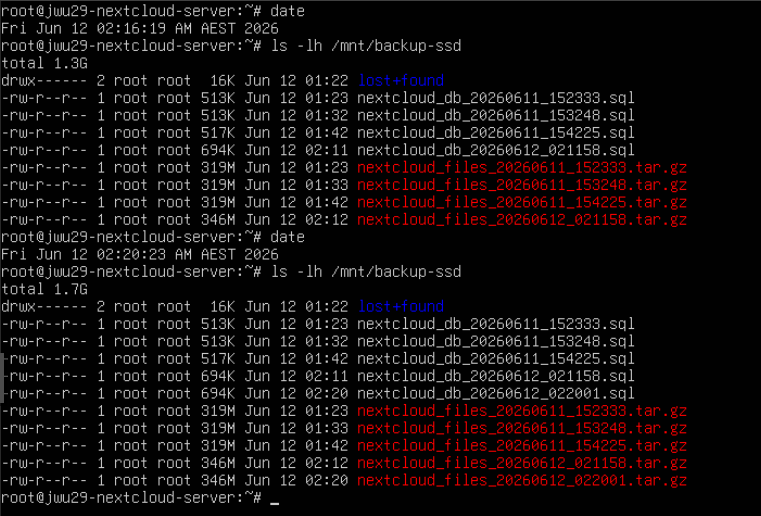

The following morning, the backup directory is inspected with `ls -lh /mnt/backup-ssd`, revealing a growing collection of timestamped backup files spanning both 11 June and 12 June. Entries timestamped around 02:20 AEST confirm that the cron job fired as scheduled and completed without any manual intervention. The on-premises backup is now fully automated.

## Remote Backup: AWS S3

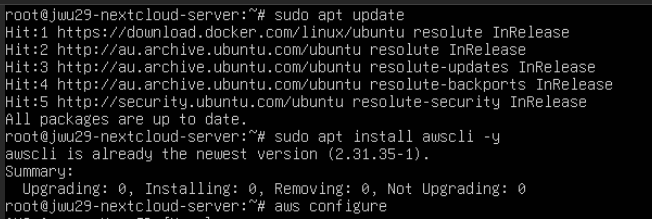

Picking up from the AWS IAM credentials prepared in Part 4, we now configure the AWS CLI on the Nextcloud server. Running `sudo apt update` confirms all packages are current, and `sudo apt install awscli -y` confirms the AWS CLI is already installed at version `2.31.35-1`. We then run `aws configure` to supply the access key ID and secret access key for the IAM user created in Part 4, along with the default region and output format.

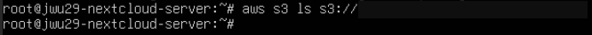

With the CLI configured, we verify connectivity to the S3 bucket with `aws s3 ls s3://<bucket-name>`. The command returns no output, confirming that the bucket exists and is accessible but currently contains no objects — exactly as expected before the first upload.

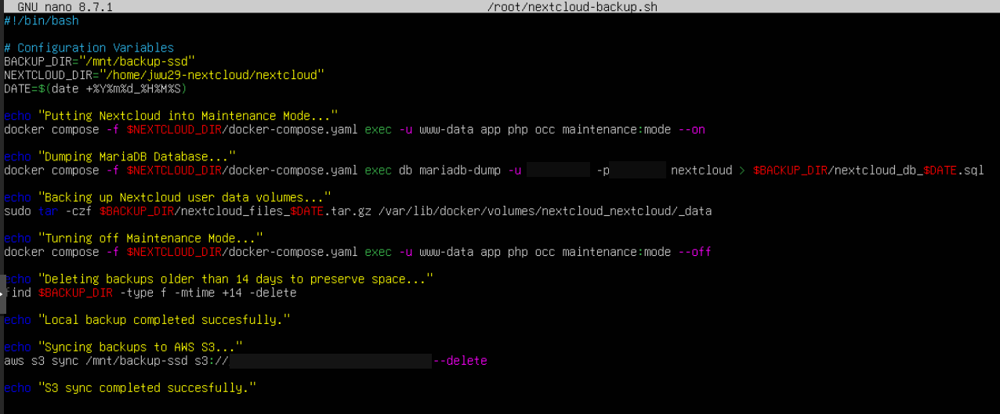

We update `nextcloud-backup.sh` to append an S3 sync step after the local SSD backup. Two new lines are added at the end of the script:

```bash
echo "Syncing backups to AWS S3..."
aws s3 sync /mnt/backup-ssd s3://<bucket-name> --delete
echo "S3 sync completed successfully."
```

The `aws s3 sync` command mirrors the contents of `/mnt/backup-ssd` to the S3 bucket, uploading any new or modified files and, thanks to the `--delete` flag, removing any objects from S3 that no longer exist locally. This keeps the bucket in sync with the local 14-day retention policy, avoiding indefinite accumulation of stale backups in S3.

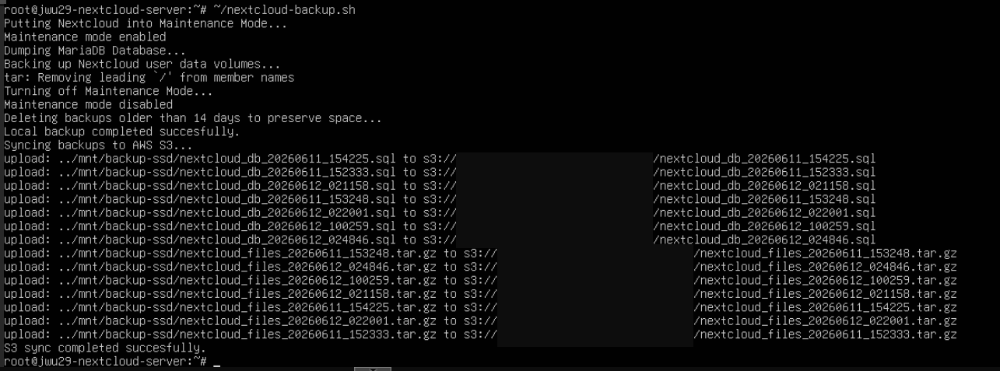

Running the updated script produces the familiar local backup output — maintenance mode, database dump, file archive, and pruning — followed by the new S3 sync section, which prints a series of `upload:` lines as each `.sql` and `.tar.gz` file is transferred to our S3 bucket. The script concludes with "S3 sync completed successfully."

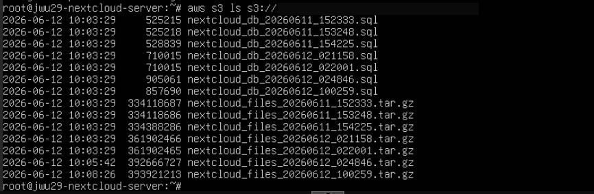

A final check confirms that 14 objects are now present in the bucket — seven `.sql` database dumps and seven `.tar.gz` file archives — spanning backup runs with file sizes ranging from approximately 500 KB for the SQL dumps to roughly 400 MB for the larger file archives.

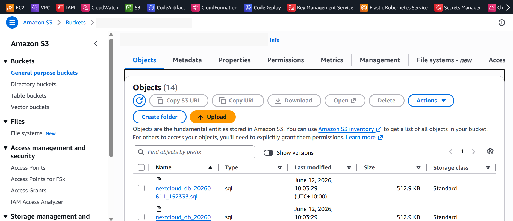

The same bucket contents are confirmed through the AWS S3 console. The bucket is listed in the **Amazon S3** interface showing 14 objects with their upload timestamps of 12 June 2026. The console view serves as a final cross-check that the files are not only reachable via the CLI but are genuinely stored and accessible within the AWS S3 service.

## Conclusion

In Part 4, we secured our Nextcloud instance behind Tailscale VPN with tag-based access control, and prepared the AWS IAM credentials that would be needed for cloud backup. This final part built upon that foundation to implement a comprehensive, fully automated backup strategy — both on-premises and in the cloud. The key achievements of this stage are as follows:

- **External SSD provisioned as on-premises backup storage**: A 256 GB USB flash drive was registered in Proxmox as a `Directory` storage backend (`external-backup`), formatted as ext4, and attached to the `nextcloud-server` VM as a passthrough hard disk at `/dev/sdb`. A persistent `fstab` entry with the `nofail` option ensures the drive is mounted at `/mnt/backup-ssd` on every boot without risking a startup hang should the device ever be absent.
- **Automated backup script implemented**: A Bash script (`nextcloud-backup.sh`) was written to orchestrate the full backup sequence — enabling Nextcloud maintenance mode, dumping the MariaDB database to a timestamped `.sql` file, archiving the Nextcloud Docker data volume as a `.tar.gz` archive, disabling maintenance mode, and pruning backups older than 14 days to conserve local disk space. The script was tested against live file changes and confirmed to faithfully capture incremental updates to the Nextcloud data volume on every run.
- **Nightly backup scheduled via cron**: The backup script was registered in the root crontab to run automatically at 02:20 AEST every night, requiring no manual intervention. The system timezone was updated to `Australia/Sydney` ahead of scheduling to ensure the job fires at the intended local time.
- **AWS S3 remote backup configured**: Using the least-privilege IAM credentials provisioned in Part 4, the AWS CLI was configured on the server and the backup script extended to sync the local backup directory to the backup S3 bucket after each local run. The `--delete` flag mirrors the local 14-day retention window in S3, preventing unbounded growth of stale objects in the cloud.

This concludes the Private Cloud home lab series. Across five parts, we have built a private cloud from the ground up: a Proxmox hypervisor hosting a fully containerised Nextcloud instance, locked down behind a Tailscale VPN with tag-based access control, and protected by an automated dual-layer backup system spanning both on-premises SSD storage and AWS S3. The entire stack runs on consumer hardware, and is designed to be resilient, maintainable, and secure. Thank you for following along — see you in the next project!

---
