## Introduction

Hello everyone! This is Part 1 of a new mini-series that extends my Private Cloud Home Lab project, this time focused on securing it properly.

1. _YOU ARE HERE!_ Network Isolation with OPNsense Firewall
2. Hardening Remote Access with Tailscale
3. Deploying Wazuh & Detecting Attacks on Nextcloud
4. Automated Email Alerting

Until now, my Nextcloud VM sat directly on the same flat home network as every other device in the house. In this part, I introduce OPNsense as a proper firewall and split the network into a WAN segment and an isolated LAN segment, so the private cloud is no longer just another device on the household Wi-Fi.

## Creating the Internal Network Segment

Proxmox only had one bridge, `vmbr0`, wired to the physical NIC and the home router. I created a second bridge, `vmbr1`, with no physical uplink at all — it exists purely to connect virtual machines to each other behind a firewall.

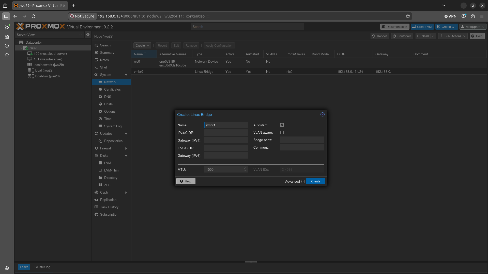

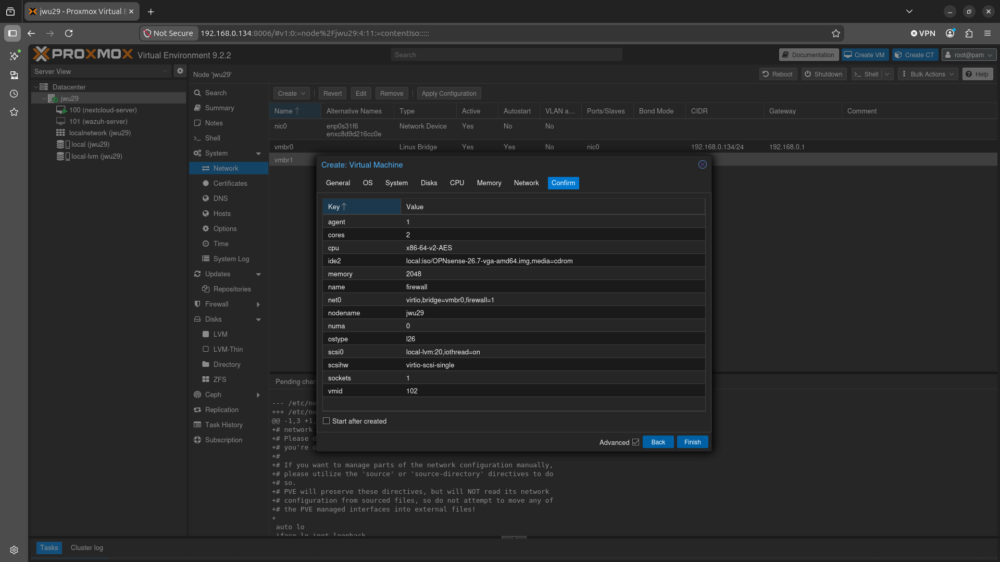

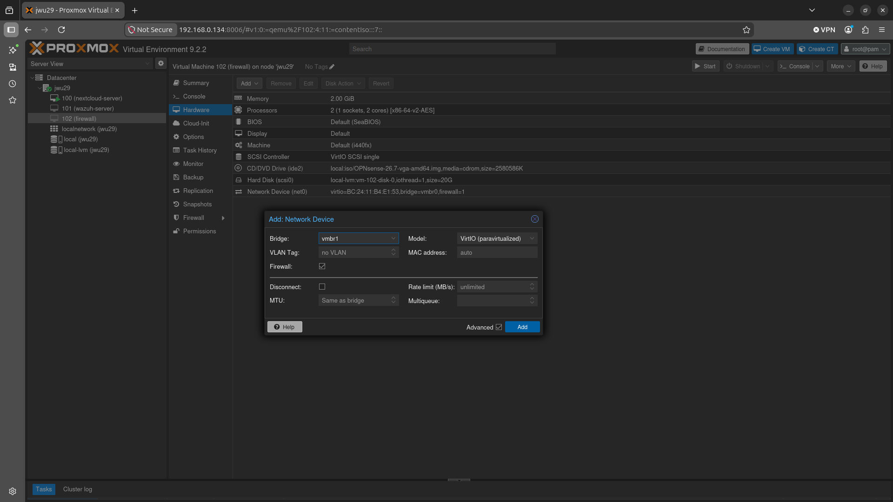

A new VM (102) was provisioned as the OPNsense firewall, with two virtual NICs: one on `vmbr0` for WAN, and one on `vmbr1` for LAN.

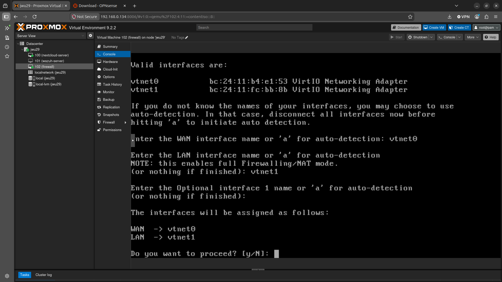

After installing OPNsense, we used the console to assign the interfaces: `LAN (vtnet1) -> 10.0.0.1/24` and `WAN (vtnet0) -> DHCP4 192.168.0.128/24`. Everything behind the LAN interface now lives on its own `10.0.0.0/24` subnet, invisible to the rest of the household network unless OPNsense explicitly allows it through.

The first attempt actually had this backwards — the WAN and LAN vNICs were wired to the wrong bridges, taking down the whole network. Rather than touching Proxmox's bridge configuration (which other VMs also depend on), the fix was to reassign interface _roles_ from OPNsense's own console menu instead.

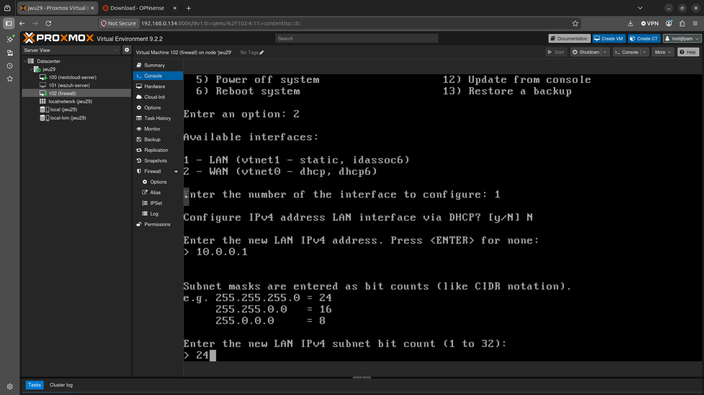

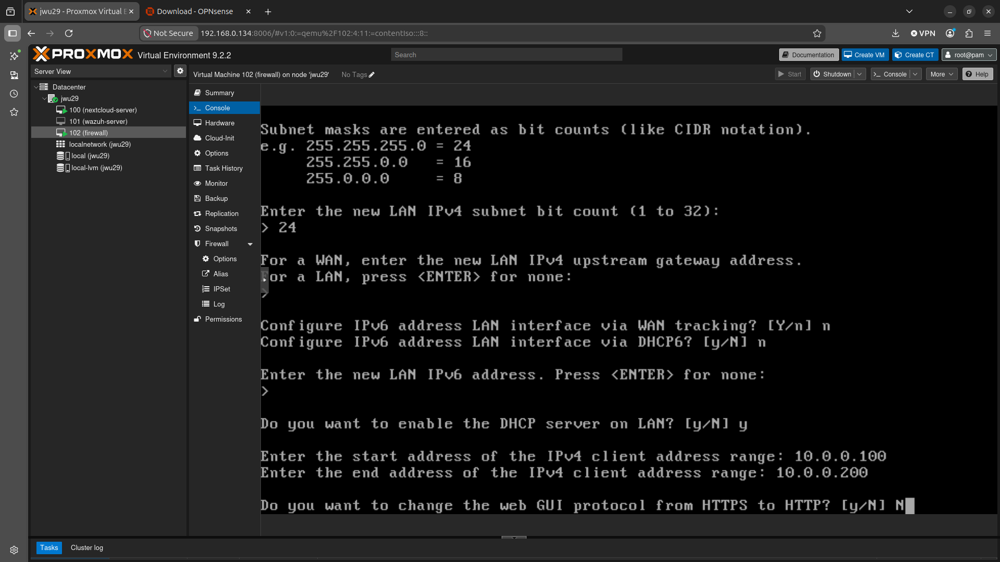

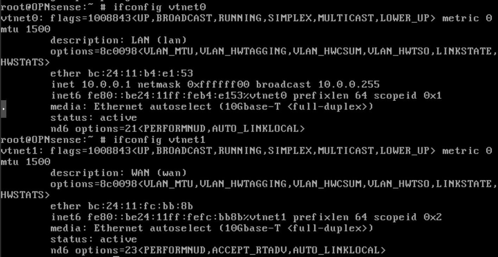

Running `ifconfig` afterwards confirms the roles are correct: `vtnet0` is labelled `WAN`, `vtnet1` is labelled `LAN`. It's a reminder that interface role and physical bridge wiring are two separate things in OPNsense, and a mismatch between them fails silently rather than throwing an obvious error.

## Migrating Nextcloud onto the Segment

With OPNsense in place, the Nextcloud VM was moved from `vmbr0` onto `vmbr1` and given a static address of `10.0.0.10/24`, gateway `10.0.0.1`.

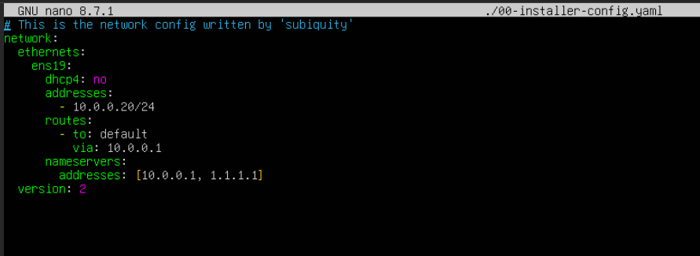

This migration wasn't painless: any change to the host's network — a new bridge, a new gateway — can leave Docker's embedded DNS resolver stale. Nextcloud immediately started throwing `500 Internal Server Error`, with the container logs showing `getaddrinfo for db failed: Temporary failure in name resolution`. MariaDB itself was healthy; Nextcloud's `app` container simply couldn't resolve the `db` hostname anymore. A `systemctl restart docker` on the host was enough to refresh the embedded resolver and bring the stack back up cleanly.

## Locking Down the Firewall Rules

By default, OPNsense ships with a single permissive "allow LAN to any" rule — functional, but not the point of adding a firewall.

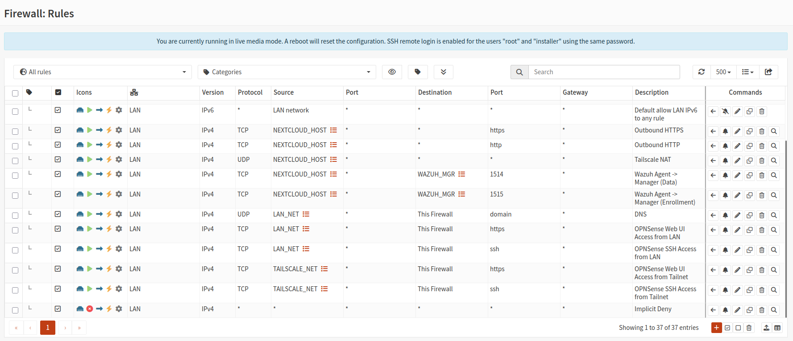

I replaced the default with explicit, purpose-built rules: outbound HTTPS/HTTP for Nextcloud, UDP for Tailscale NAT traversal, and TCP 1514/1515 so the Nextcloud VM can reach the Wazuh manager for agent data and enrolment (covered in Part 3). LAN devices and Tailscale peers are separately permitted to reach OPNsense's own web UI and SSH, and everything else is implicitly denied.

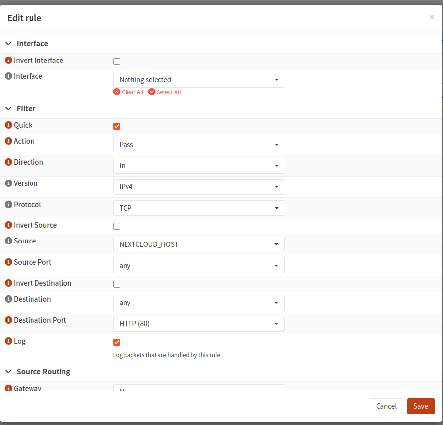

Each rule references reusable aliases rather than hard-coded IPs, which keeps the ruleset readable as the lab grows.

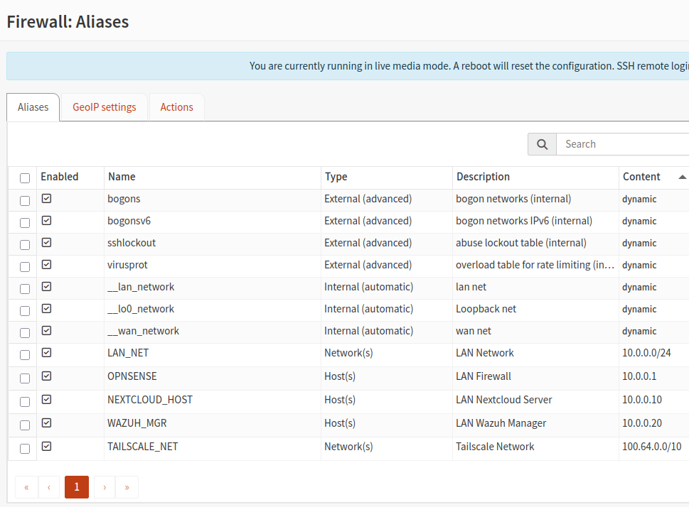

`NEXTCLOUD_HOST` (10.0.0.10), `WAZUH_MGR` (10.0.0.20), and `TAILSCALE_NET` (100.64.0.0/10, the Tailscale CGNAT range) do the heavy lifting here — if an IP ever changes, it's a one-line edit rather than a rule-by-rule hunt.

The finished ruleset ends in an implicit deny, so anything not explicitly permitted — including any lateral movement attempt from a compromised device on the segment — is dropped by default.

## Conclusion

This part laid the network foundation the rest of the security series builds on:

- **Segmented the network with OPNsense**: a new `vmbr1` bridge isolates the Nextcloud and (soon) Wazuh VMs behind a dedicated firewall, on their own `10.0.0.0/24` subnet separate from the household network.
- **Fixed an interface role mismatch**: WAN and LAN vNICs were reassigned correctly via OPNsense's console, without touching Proxmox's shared bridge configuration.
- **Migrated Nextcloud onto the segment**: moved to a static `10.0.0.10` address, with the resulting Docker embedded-DNS breakage diagnosed and resolved.
- **Replaced default-allow rules with explicit ones**: alias-driven firewall rules now permit only the specific traffic each service needs, ending in an implicit deny.

With the network segmented and the firewall locked down, Part 2 turns to Tailscale — tightening the ACL policy that governs who can reach this new LAN segment remotely, and troubleshooting the subnet router that makes it possible. See you there!

---
