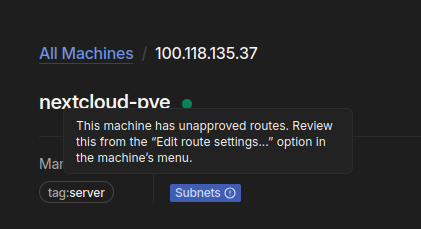
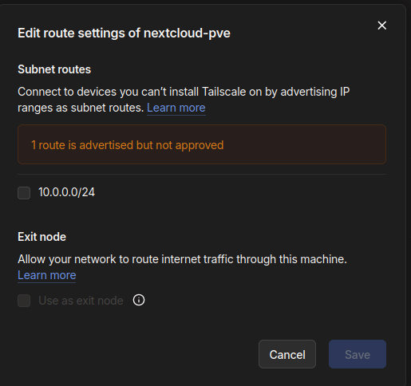
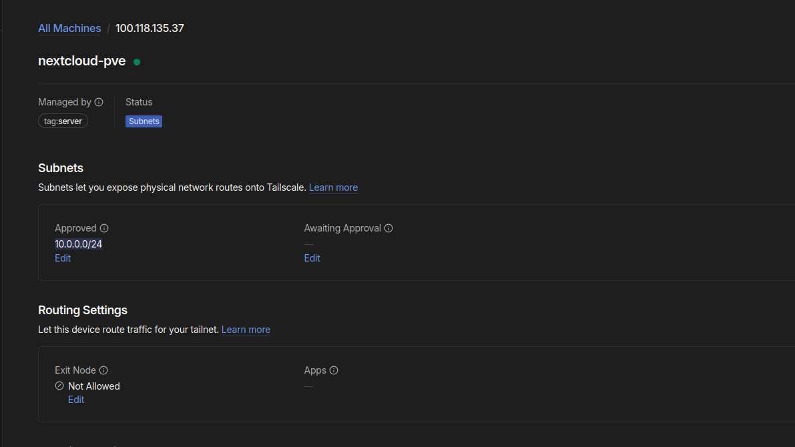
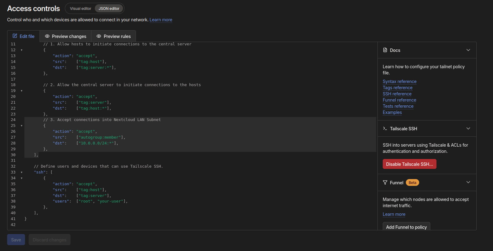
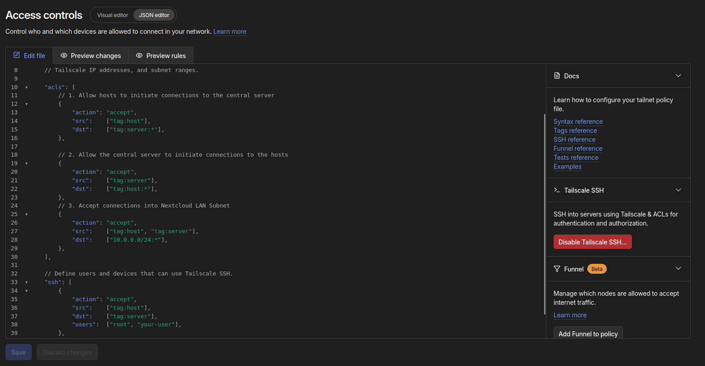
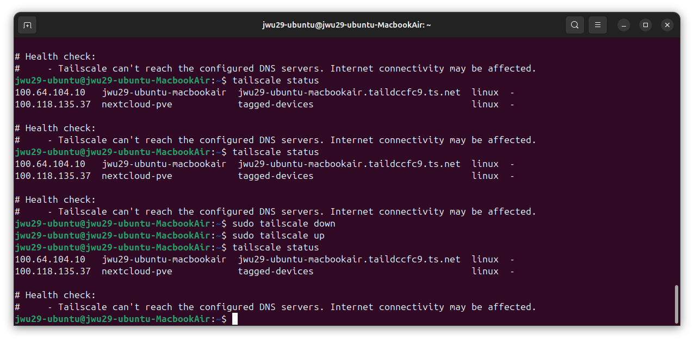

## Introduction

Welcome back! This is Part 2 of the Home Lab Security series, following on from segmenting the network with OPNsense in Part 1.

1. Network Isolation with OPNsense Firewall
2. _YOU ARE HERE!_ Hardening Remote Access with Tailscale
3. Deploying Wazuh & Detecting Attacks on Nextcloud
4. Automated Email Alerting

Nextcloud has been reachable remotely via a Tailscale sidecar since the original series, using `TS_AUTHKEY` and `TS_ROUTES=10.0.0.0/24` in the Docker Compose file to advertise the new LAN segment as a subnet route. With the network now properly segmented behind OPNsense, this part tightens up exactly who that subnet route is exposed to.

## Approving the New Subnet Route

Because the LAN subnet changed from a flat home network to `10.0.0.0/24` behind OPNsense, the `nextcloud-pve` node's advertised route needed re-approving in the Tailscale admin console.

The **Machines** page shows `nextcloud-pve` at `100.118.135.37`, tagged `tag:server`, with a warning that it has unapproved routes.

Opening its route settings confirms the `10.0.0.0/24` route is advertised but sitting unapproved — Tailscale deliberately requires a human to approve any subnet route before traffic actually flows through it, which is a sensible brake against a compromised node silently exposing a new network.

Once approved, any `tag:host` device on the tailnet can reach the whole `10.0.0.0/24` segment — including OPNsense's own web UI — without needing a direct connection to the Proxmox console.

## Fixing the Access Control Policy

The tailnet uses two tags: `tag:host` for personal devices and `tag:server` for infrastructure. My first attempt at the ACL policy allowed the LAN subnet to be reached using `autogroup:member` as the source.

That rule looks reasonable, but it's actually dead code: `autogroup:member` only matches _untagged_ devices, and every device on this tailnet is tagged as either `tag:host` or `tag:server`. There are no untagged members for it to match, so the rule silently granted access to nobody.

The fix was to reference the actual tags directly — `["tag:host", "tag:server"]` — as the source for the LAN subnet rule.

The visual editor confirms the finished policy: `tag:host` can reach `tag:server` on any port, `tag:server` can reach `tag:host` on any port, and both together can reach the `10.0.0.0/24` subnet. Simple, but it means every rule now maps to a tag that actually exists on a device — nothing relies on an empty group.

## Chasing a DNS Health Warning

While testing from the Macbook Air, `tailscale status` kept surfacing a warning: _"Tailscale can't reach the configured DNS servers. Internet connectivity may be affected."_

Cycling the connection with `sudo tailscale down` and `sudo tailscale up` didn't clear it, and basic connectivity — reaching both tailnet peers and the wider internet — was unaffected throughout. It's logged here as a known rough edge rather than a fixed bug: worth another look if it ever starts affecting real traffic, but not something to chase down for its own sake when nothing is actually broken.

## Conclusion

Part 2 focused on making sure Tailscale's access controls actually do what they appear to do:

- **Re-approved the LAN subnet route**: after the OPNsense migration changed the LAN subnet, the `10.0.0.0/24` route advertised by the `nextcloud-pve` node was manually re-approved in the Tailscale admin console, as it should be for any newly advertised network.
- **Found and fixed a no-op ACL rule**: an `autogroup:member` source matched nothing on this fully-tagged tailnet, silently granting no access at all. Replacing it with explicit `tag:host`/`tag:server` references made the rule actually enforce what it was written to enforce.
- **Verified the final policy**: `tag:host` and `tag:server` devices can now reach each other, and together can reach the LAN subnet — visible and confirmed in both the JSON and visual ACL editors.
- **Logged an open DNS health warning**: not resolved yet, but connectivity is unaffected, so it's tracked rather than urgently chased.

With the network segmented and remote access properly scoped, Part 3 moves on to deploying Wazuh as a SIEM and writing detection rules for Nextcloud itself — including a decoder mismatch that quietly stopped the very first rule from ever firing. See you there!

---
