## Introduction

Welcome to Part 3 of the Home Lab Security series! With the network segmented in Part 1 and remote access hardened in Part 2, it's time to actually start watching what happens on the private cloud.

1. Network Isolation with OPNSense Firewall
2. Hardening Remote Access with Tailscale
3. _YOU ARE HERE!_ Deploying Wazuh & Detecting Attacks on Nextcloud
4. Automated Email Alerting

Wazuh is an open-source SIEM which allows agents on monitored hosts forward logs to a central manager. It decodes the logs, matches them against rules, and raises alerts. On our Proxmox Mini PC, a new VM (6GB RAM, JVM heap capped at 2GB for the indexer) was provisioned to run the all-in-one Wazuh stack, with an agent deployed onto the Nextcloud VM to ship its logs across.

## Installing the Agent

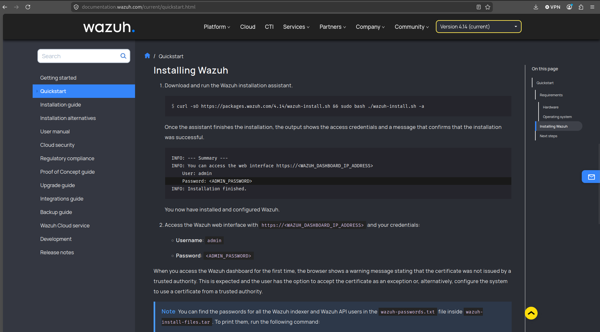

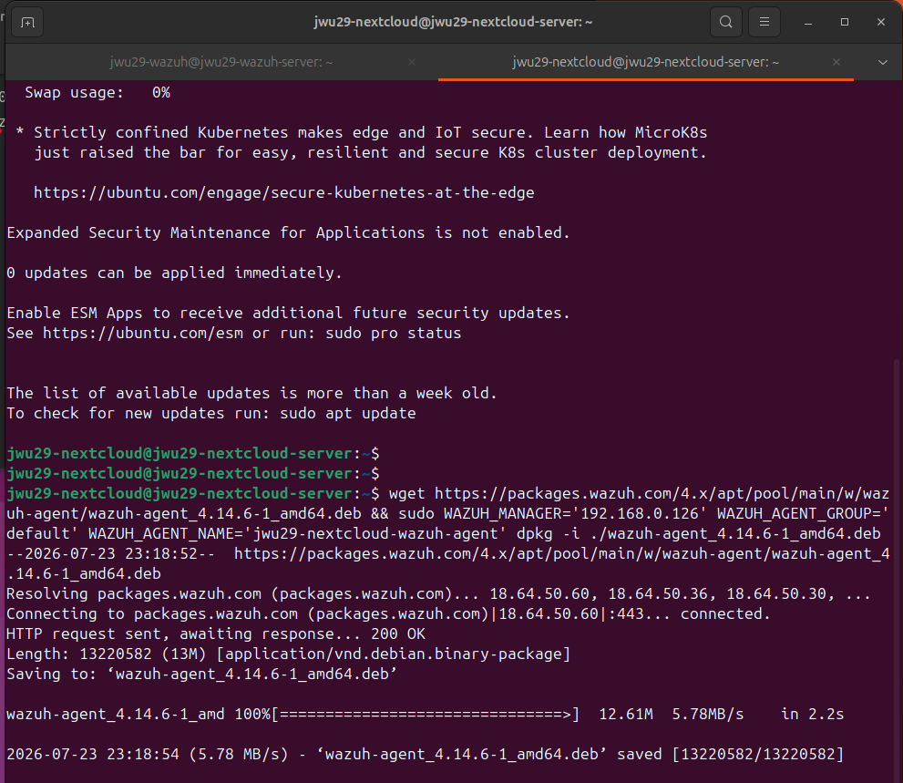

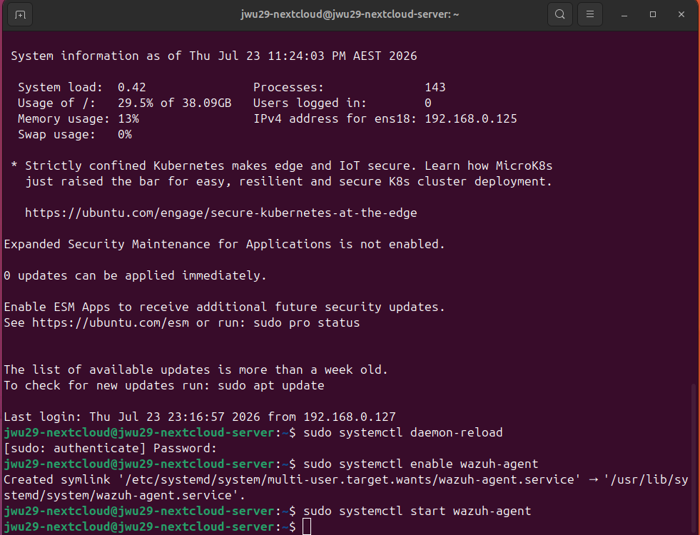

Here we follow the instructions from the Wazuh official page: we use the `wget` command to install Wazuh directly onto the Nextcloud VM, and `systemctl enable wazuh-agent`, `systemctl start wazuh-agent` to start the wazuh agent.

## Pointing the Agent at the Right Log

Nextcloud writes structured JSON logs to `nextcloud.log` inside its Docker data volume. The agent's `ossec.conf` needed a `<localfile>` block telling it exactly where to find that file inside the container's mounted path.

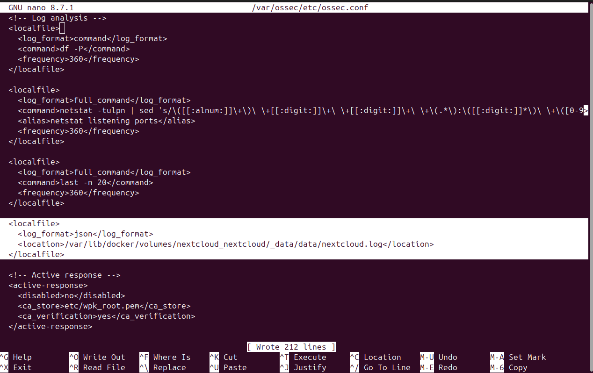

`docker volume inspect nextcloud_nextcloud` reveals the actual mountpoint on the host: `/var/lib/docker/volumes/nextcloud_nextcloud/_data/data/nextcloud.log`. With that path in `ossec.conf` and the agent restarted, Wazuh starts receiving every login attempt, file operation, and permission change Nextcloud logs.

Back onto Wazuh, we can see the logs are flowing into the Wazuh agent.

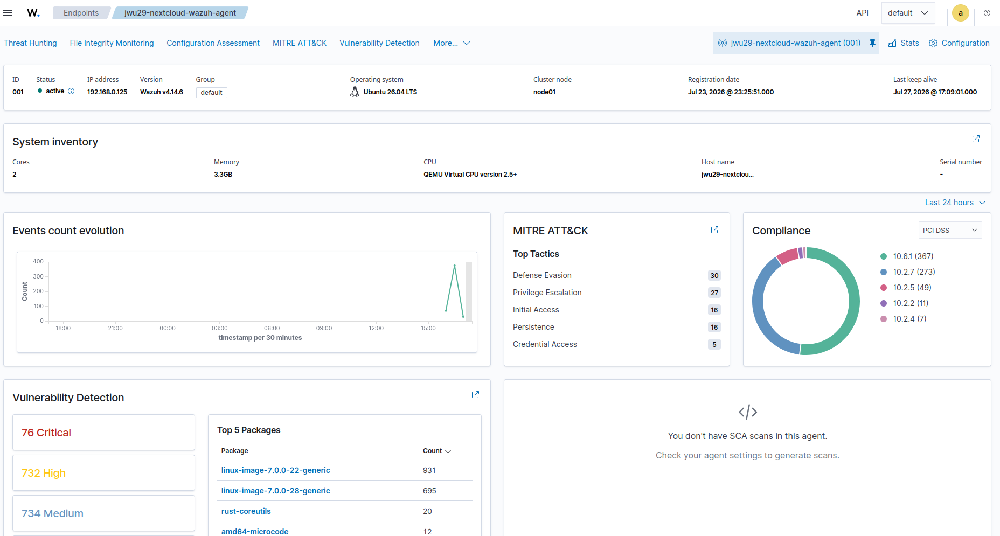

## Detection and Rules writing

With logs flowing in, the next step was giving Wazuh something to actually watch for. Wazuh's `syscheck` module handles File Integrity Monitoring (FIM) — periodic scans that flag files added, changed, or deleted under configured paths. On top of the defaults, two directories from the Nextcloud Docker volume were added: `config`, where changes should be rare and deliberate, and `data`, so any unexpected create, modify, or delete against a user's actual files would raise an alert.

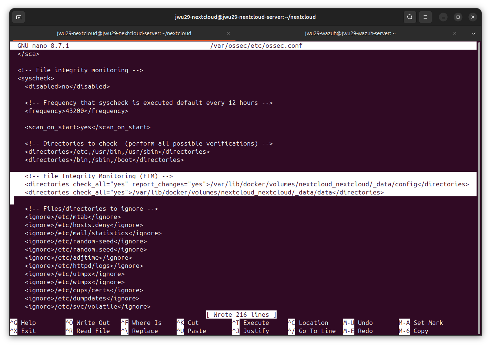

With the filesystem covered, attention turned to the log stream itself. A `nextcloud` rule group went into `local_rules.xml`: rule `100100` flags any Nextcloud log line reporting a level-3 (error) event, and rule `100101` escalates to a level-10 alert when five of those errors arrive from the same source IP within 120 seconds — a first pass at a brute-force heuristic.

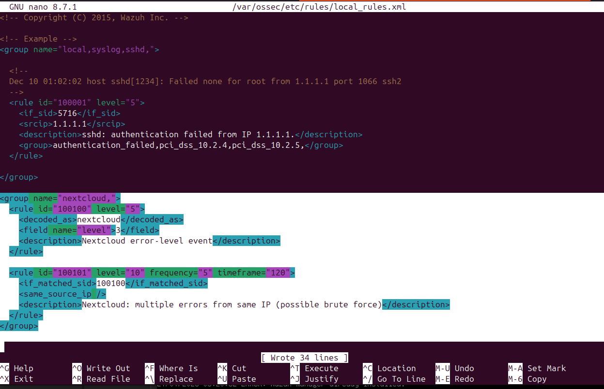

## The Decoder Mismatch

Writing rules against JSON fields sounds trivial — until the rule simply never fires. At the start, we tried to write a purpose-built custom decoder for Nextcloud's log format:

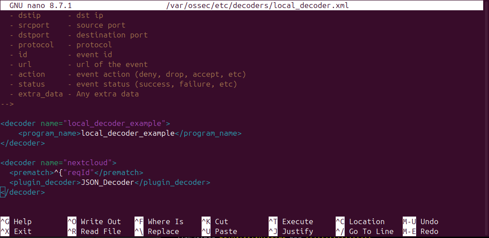

This decoder prematches on `^{"reqId"` and hands the line to Wazuh's JSON plugin decoder. Sensible in isolation — except we realised later that Wazuh stops at the _first_ decoder that matches a log line, and its own built-in generic `json` decoder was matching first every time, before the custom `nextcloud` decoder ever got a look in.

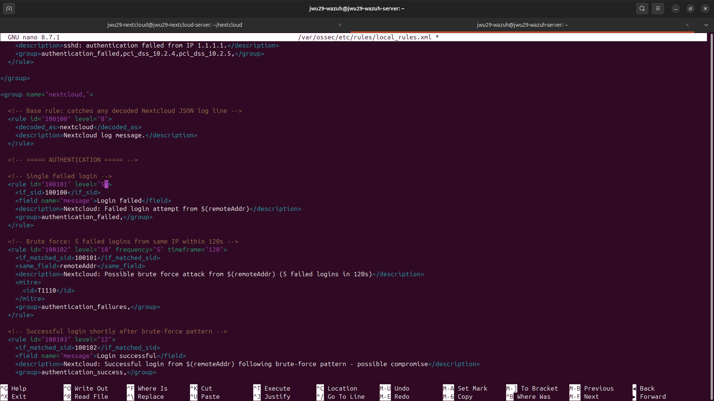

Every rule keyed on `<decoded_as>nextcloud</decoded_as>` was consequently dead on arrival: correctly written, correctly loaded, and never once matched.

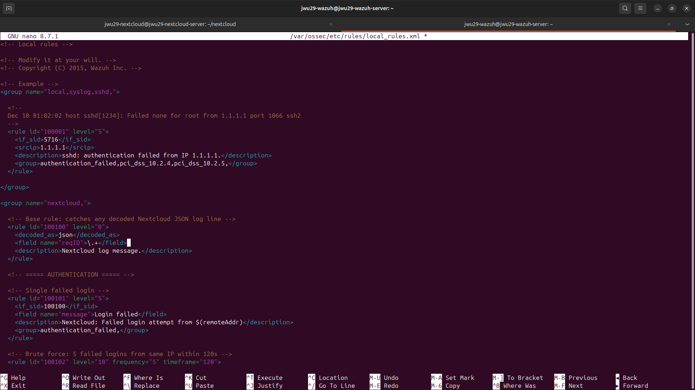

The fix was to stop fighting the built-in decoder and use it instead — rules now key off `<decoded_as>json</decoded_as>`, disambiguated with `reqId`, a field unique to Nextcloud's log format.

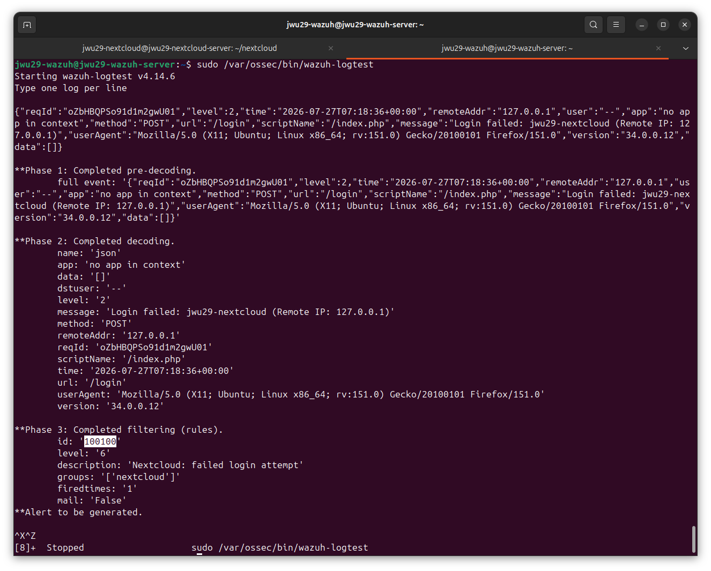

We could use `wazuh-logtest` against real log lines, this correctly separated Nextcloud's traffic from every other JSON source Wazuh might see.

## Building the Detection Rules

With the decoder problem solved, a small rule set took shape in `local_rules.xml`: a level-0 gate rule matching any Nextcloud log line, single failed logins at level 5, and a brute-force rule watching for five failed logins from the same IP within 120 seconds, tagged with MITRE ATT&CK technique T1110.

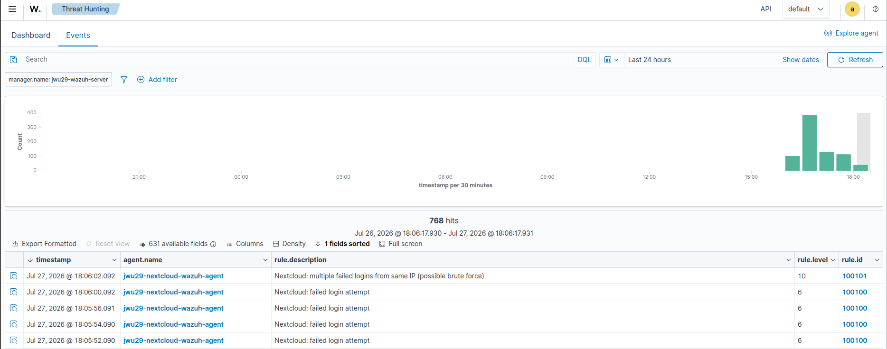

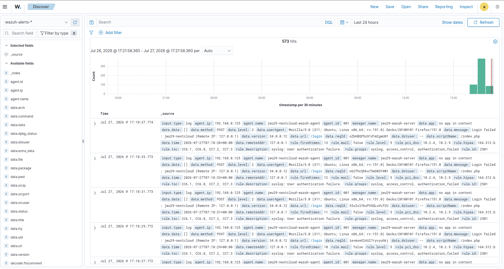

The dashboard confirms it working end-to-end: rule 100100 firing on each failed login, escalating to the brute-force rule once the fifth attempt lands inside the 120-second window. From here the rule set was extended further — successful logins shortly after a brute-force pattern, public share creation, and mass file deletion or modification as ransomware indicators — following the same `decoded_as json` pattern throughout.

## Conclusion

Part 3 turned Wazuh from an installed service into an actual detection capability:

- **Deployed the Wazuh manager and agent**: a dedicated VM runs the all-in-one stack, with an agent on the Nextcloud VM pointed at the correct log path inside its Docker volume.
- **Diagnosed a decoder mismatch**: a custom decoder for Nextcloud's JSON logs was silently losing out to Wazuh's built-in generic `json` decoder, which always matches first — so every rule built against it never fired.
- **Fixed it by working with the built-in decoder**: rules now key off `decoded_as json` plus the unique `reqId` field, verified line-by-line with `wazuh-logtest`.
- **Built and verified a real rule set**: failed logins, brute-force detection with MITRE tagging, and file-operation rules, confirmed firing correctly against live login attempts on the dashboard.

Detection is only useful if someone actually sees the alert. Part 4 wires these rules up to real email notifications — including a dead-end down the msmtp rabbit hole before landing on a working solution. See you there!

---
