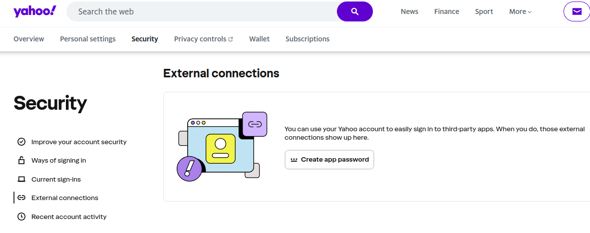
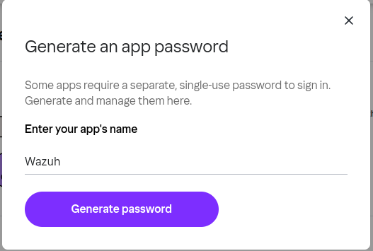
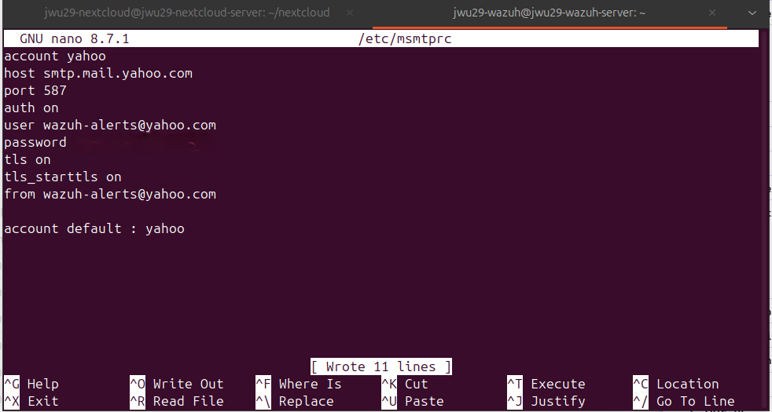
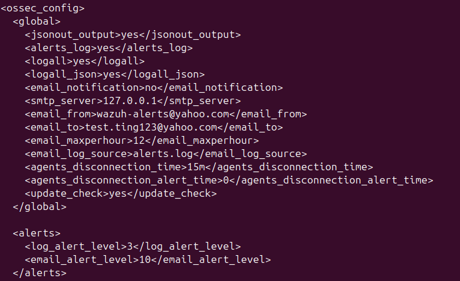
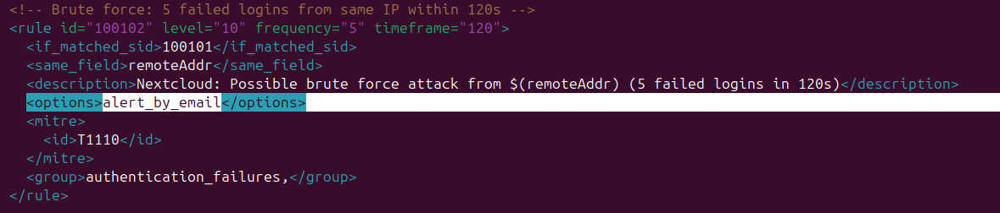
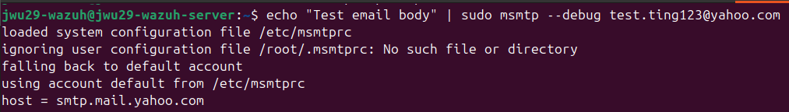
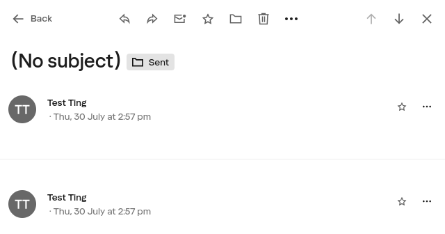
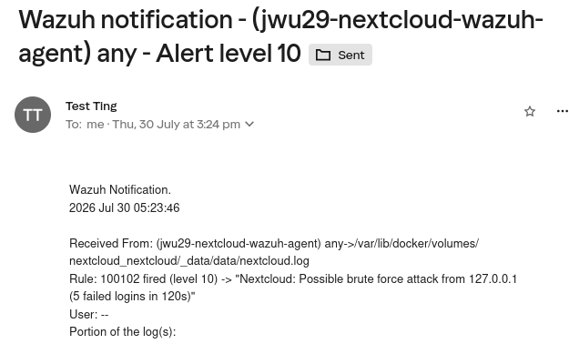

## Introduction



Welcome to the final part of the Home Lab Security series! We ended Part 3 with Wazuh correctly detecting brute-force attempts against Nextcloud. However, we want to avoid alert fatigue for future purposes, so this part is about setting up real email notification when a Wazuh alert is triggered.

1. Network Isolation with OPNsense Firewall
2. Hardening Remote Access with Tailscale
3. Deploying Wazuh & Detecting Attacks on Nextcloud
4. _YOU ARE HERE!_ Automated Email Alerting

## Generating a Mailbox App Password

We will first setup email notificaitons for Wazuh alerts. Wazuh's mailer (`wazuh-maild`) needed a real, owned mailbox to authenticate with, and its SMTP auth requires the `user`/`from` to match a genuine account. It also won't accept a normal account password over SMTP; it needs a dedicated app password. Therefore, we decided to use Yahoo, as it provides the function to generate an app password for access.



From the Yahoo account's Security settings, an app password was generated specifically for Wazuh and stored in a root-only, `chmod 600` environment file — never in `ossec.conf` itself.

## A Dead End: msmtp

I first tried to configure `msmtp` as a local sendmail replacement, pointing it at Yahoo's SMTP server with the new app password.



It worked when tested by hand — but Wazuh's `wazuh-maild` never called it. `wazuh-maild` speaks SMTP directly over a socket to whatever host is configured in `<smtp_server>`; it doesn't shell out to `sendmail` or `msmtp` at all. All the time spent getting `msmtp` working (including an AppArmor profile blocking its helper subprocesses) turned out to be extra hassle, so I decided to save it in the file instead (which is not good practice).

## Configuring Wazuh's Mailer Directly

We then implement our fix inside Wazuh's main config file, which is`/var/ossec/etc/ossec.conf`. An earlier attempt had placed `email_alert_level` inside `<global>`, where it's silently ignored — it belongs in its own `<alerts>` block.

```xml
<alerts>
  <log_alert_level>3</log_alert_level>
  <email_alert_level>10</email_alert_level>
</alerts>
```

With that corrected, and `<smtp_server>` pointed at a local Postfix instance configured as an authenticated relay to Yahoo (`smtp.mail.yahoo.com:587`, with sender rewriting so the local Linux username stopped leaking into the envelope `MAIL FROM` and getting rejected as spoofing), `wazuh-maild` had a real path to deliver mail.



We also want to setup email alerts for rules that are worth alerting. In this case, we trigger for any alert with level 10 or above. Below is an example of setting up email alerts for the brute force login rule (which has level 10):



```xml
<options>alert_by_email</options>
```

## Watching It Actually Fail, Then Work

The first live attempts still bounced:





We confirm that the test email works. Finally, we can trigger a real brute-force test (five failed Nextcloud logins) produced exactly what the previous three parts were building towards: an email landing in the inbox seconds later, carrying the rule ID, description, and the raw JSON log line that triggered it.



## Conclusion

This closes out the Home Lab Security series:

- **Provisioned a dedicated mailbox app password**, kept out of Wazuh's own config and stored root-only.
- **Ruled out msmtp**: a working SMTP client that Wazuh's mailer was never going to call, since `wazuh-maild` talks SMTP directly.
- **Fixed the real configuration issues**: `email_alert_level` moved into its own `<alerts>` block, a Postfix relay standing in as the SMTP endpoint, and `alert_by_email` enabled on the rule itself.
- **Confirmed real, working alerts**: a live brute-force test now lands a full alert email within seconds, closing the loop from detection to notification.

Over four parts, this private cloud has gone from a single flat-network VM to a segmented network behind a real firewall, access scoped tightly over Tailscale, a working SIEM watching Nextcloud's every login, and alerts landing directly in an inbox the moment something looks wrong. Thanks for reading my series of articles!

---
