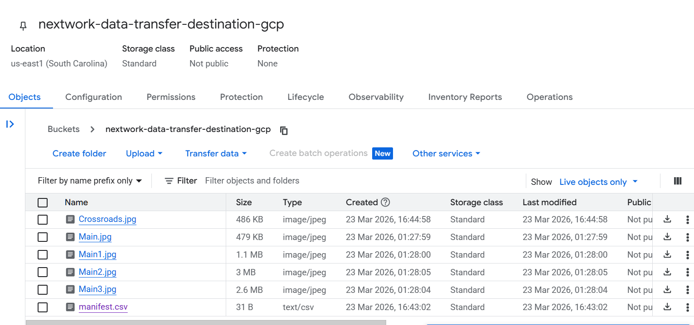

## Introducing Today's Project!

In this project, I connected AWS and Google Cloud Platform (GCP) to create an automated backup pipeline — moving files from an S3 bucket into Google Cloud Storage (GCS) using GCP's Storage Transfer Service.

**What I did:**

- Created an S3 bucket in AWS and uploaded image files for testing
- Set up a GCP project and configured a destination GCS bucket
- Used Storage Transfer Service to back up files from AWS S3 to GCS
- Created a custom IAM role granting GCP permission to read from AWS
- Set up a selective transfer using a manifest file to control exactly which files move

### Tools and concepts

Services I used: Amazon S3, AWS IAM, Google Cloud Storage, GCP Storage Transfer Service.

Key concepts: multi-cloud architecture, identity federation, trust policies, manifest-based transfers.

### Project reflection

This project taught me how to bridge two major cloud providers securely without exchanging long-lived credentials. The identity federation approach was more elegant than I expected — once the trust relationship was established, the transfer ran seamlessly.

---

## Setting up Data in S3

I started by creating an S3 bucket and uploading a set of image files. These files would serve as the source data for the transfer.

---

## Setting up GCP

I created a new GCP project and enabled the Storage Transfer API. I also created a destination GCS bucket in a region close to my AWS bucket to minimise latency and data egress costs.

**Key GCS bucket settings:**

- **Region**: Chosen to be geographically close to the S3 source bucket
- **Storage class**: Standard — suitable for frequently accessed data and active transfers

---

## Storage Transfer

Data transfers between cloud providers are essential for **disaster recovery**, **data redundancy**, and avoiding vendor lock-in. Storing data across AWS and GCP means a regional outage on one provider does not leave you without access to your data.

**GCP's Storage Transfer Service** is a managed service that automates the movement of data from external sources — including Amazon S3 — into Google Cloud Storage. It handles authentication, scheduling, and retry logic without requiring you to manage infrastructure.

There are two types of transfer you can configure:

- **One-time transfer**: Runs immediately and completes once. Ideal for a single migration or initial sync.
- **Recurring transfer**: Runs on a schedule (daily, for example). Ideal for ongoing backups where new files are added regularly.

The key difference is that recurring transfers check for new or changed objects since the last run, whereas one-time transfers copy everything matching the source configuration at that moment.

---

## Granting GCP Access to AWS

To connect GCP to AWS, I used **identity federation** — a method that allows GCP's service account to assume a temporary AWS IAM role without needing static access keys. This works by establishing a trust relationship between the two clouds: AWS trusts requests signed by GCP's identity, and in return grants limited, time-scoped permissions.

This is more secure than alternatives because:

- No long-lived AWS access keys are created or stored
- Credentials are temporary and automatically rotated
- Access is scoped to exactly the permissions the transfer needs

I created a **custom IAM role** for GCP access rather than using an existing role, because it allows me to apply least-privilege — granting only `s3:GetObject` and `s3:ListBucket`, nothing more.

Within that role, I wrote a **custom trust policy** because the default EC2 or Lambda trust templates do not account for external identity providers. The trust policy identifies GCP's Storage Transfer Service agent using a **subject ID** — a unique identifier assigned by GCP to each transfer job's service account. AWS verifies this ID before issuing temporary credentials.

---

## Transferring from S3 to GCS

With the IAM role in place, I configured the transfer job in Storage Transfer Service:

1. Set the source to **Amazon S3** and provided the bucket name
2. Set the destination to my GCS bucket
3. Referenced the IAM role ARN so GCP could authenticate with AWS
4. Chose a one-time transfer for the initial run

I verified the transfer was successful by navigating to **Cloud Storage > Buckets** in the GCP Console and confirming that all source files had appeared in the destination bucket with matching names and sizes.

---

## Transfer with a Manifest

As a project extension, I explored **manifest-based transfers** — a powerful feature for large-scale migrations where you only want to move a specific subset of files.

A **manifest file** is a plain-text CSV listing the exact object keys you want to transfer. Rather than copying the entire bucket, Storage Transfer Service reads the manifest and transfers only those listed objects.

**Why this matters:**

- In a bucket with thousands of files, you may only need to migrate a fraction
- A manifest gives you precise control without complex prefix filters
- It is reproducible — you can re-run the same manifest to verify or re-sync specific files

I uploaded additional files to the S3 bucket, created a manifest listing only the new ones, uploaded the manifest to GCS, and configured a new transfer job pointing to it. The result: only the manifested files appeared in GCS after the run.

I verified the selective transfer by checking **Cloud Storage > Buckets** and confirming only the expected files were present.

---
